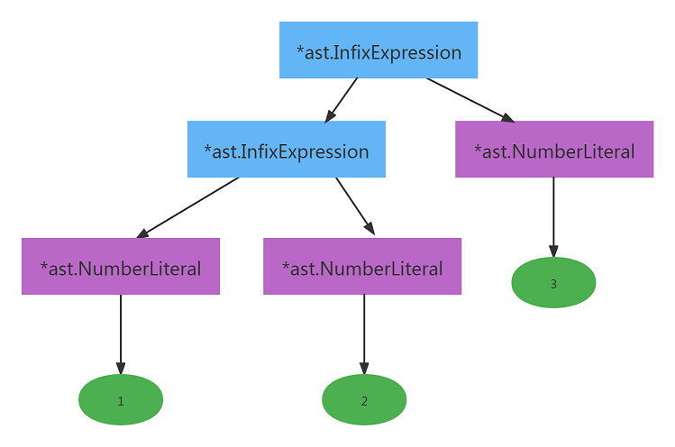

# 简单计算器

## 设计语言的“标准流程”

在实现计算器之前，我们需要简单的了解一下，设计一门语言的所谓的“标准”流程。

> 这里所谓的“标准”是针对于树遍历解释器（Tree walking interpreter）来说的。


这里的步骤从表面上看起来还是比较简单的：

1. 词法分析器接受输入（一般是文件或者字符串），然后输出一系列的词元（Token）。
2. 语法分析器对词元（Token）进行处理，生成对应的抽象语法树（AST）。
3. 解释器对AST进行解释，执行相应的脚本动作。


> 对于词法分析器，有的语言使用Scanner术语，有的使用Lexer术语，但结果都是输出词元（Token）。
>
> AST : Abstract Syntax Tree（抽象语法树），对于代码来说，其实就是一个`go`语言的结构。


请记住上面的“标准”流程。下面让我们开始一步一步实现我们的简单计算器。


## 词元（Token）

【词元】简单的说，就是解析语言的最小单元。

这里还是使用例子来进行说明，假设我们的语言支持如下的语句（statement）：

```javascript
let num = 10 + 20;
```

我们需要把这个句子拆分成一个个独立的单元（类似于中文语言中一句话中的单词）。我们的词法分析器（Lexer），遇到上面的输入，输出的词元（Token）类型（Token Type）如下：

```
TOKEN_LET             // let
TOKEN_IDENTIFIER      // num
TOKEN_ASSIGN          // =
TOKEN_NUMBER          // 10
TOKEN_PLUS            // +
TOKEN_NUMBER          // 20
TOKEN_SEMICOLON       // ;
```

那么这里所说的词元（Token）需要包含哪些信息呢？一个词元（Token）需要包含如下的信息：

1. 词元类型（Token Type)，通常将其定义为常量
2. 词元位置（Position），作为将来调试用或者报错用
3. 词元字面量（Literal），词元所表示的实际值（或者字面量）


> 字面量：顾名思义就是字面本身的值。例如`2.5`的字面量就是`2.5`。`Hello`的字面量就是`Hello`, `var1`的字面量就是`var1`。


### 词元类型（Token Type）

假设我们的简单四则运算器的输入如下：

```
2 + (3 * 4) / ( 6 - 3 ) + 10 * 1.5 + 2 ** 3
```

从上面的例子中可以看出，这里的Token类型包含【+】，【-】，【*】，【/】，【**】，【数字】，【括号（包括左括号和右括号）】。

词元类型一般是用常量来定义的，对于我们将要实现的简单四则运算器，词元类型定义如下：

```go
//token.go
type TokenType int //定义词元类型为一个整形

//定义Token类型
const (
	TOKEN_ILLEGAL TokenType = (iota - 1) // 非法词元
	TOKEN_EOF                            // 文件(或输入)结束Token（EOF：End of file)

	TOKEN_PLUS     // +
	TOKEN_MINUS    // -
	TOKEN_MULTIPLY // *
	TOKEN_DIVIDE   // '/'
	TOKEN_MOD      // '%'（取模）
    TOKEN_POWER    // ** （开方）

	TOKEN_LPAREN // (
	TOKEN_RPAREN // )

	TOKEN_NUMBER //数字，例如10、10.1等
)
```


### 词元位置（Token Position）

【位置】信息需要有诸如`行号`，`列号`等信息，下面是其定义：

```go
//token.go

//词元的【位置】
type Position struct {
    Filename string //文件名(当脚本的输入为字符串的时候，为空)
    Offset   int //当前词元相对于整个文件或者输入的偏移量(暂时作用不大)
	Line     int //当前词元所在的行号
	Col      int //当前词元所在的列号
}

//调试用
//可以使用类似`fmt.Printf("Position=%s\n", position)`的语句来打印Position结构
func (p Position) String() string {
	var msg string
	if p.Filename == "" {
		msg = fmt.Sprint(" <", p.Line, ":", p.Col, "> ")
	} else {
		msg = fmt.Sprint(" <", p.Filename, ":", p.Line, ":", p.Col, "> ")
	}

	return msg
}

//位置的字符串表示。调试用（脚本错误的时候会报告相应的行号）
//这里我们不能使用`Line()`作为函数名, 因为`Line`是Position结构的字段名
func (p Position) Sline() string { //Sline: String line
	var msg string
	if p.Filename == "" {
		msg = fmt.Sprint(p.Line)
	} else {
		msg = fmt.Sprint(" <", p.Filename, ":", p.Line, "> ")
	}
	return msg
}
```

这里的Position结构浅显易懂，应该没有太多需要解释的地方。


### 词元结构（Token Structure）

有了上面的说明，下面来定义我们的词元结构。大致如下：

```go
//token.go

//词元结构
type Token struct {
	Pos     Position    //词元的位置信息
	Type    TokenType   //词元的类型
	Literal string      //词元的字面量
}

//词元类型的字符串表示（调试或者测试用）
func (tt TokenType) String() string {
	switch tt {
	case TOKEN_ILLEGAL:
		return "ILLEGAL"
	case TOKEN_EOF:
		return "EOF"

	case TOKEN_PLUS:
		return "+"
	case TOKEN_MINUS:
		return "-"
	case TOKEN_MULTIPLY:
		return "*"
	case TOKEN_DIVIDE:
		return "/"
	case TOKEN_MOD:
		return "%"
	case TOKEN_POWER:
		return "**"

	case TOKEN_LPAREN:
		return "("
	case TOKEN_RPAREN:
		return ")"

	case TOKEN_NUMBER:
		return "NUMBER"

	default:
		return "UNKNOWN"
	}
}

//词元的字符串表示。调试用
//可以使用类似`fmt.Printf("token=%s\n", tok)`的语句来打印词元结构
func (t Token) String() string {
	return fmt.Sprintf("Position: %s, Type: %s, Literal: %s", t.Pos, t.Type, t.Literal)
}

```

为了让读者加深理解，这里再次举个例子：

```go
2 + (3 * 5) - 10
```

对于上面的例子，共有10个词元类型(Token Type)：

```
TOKEN_NUMBER      ---> 字面量是【2】
TOKEN_PLUS        ---> 字面量是【+】
TOKEN_LPAREN      ---> 字面量是【(】
TOKEN_NUMBER      ---> 字面量是【3】
TOKEN_MULTIPLY    ---> 字面量是【*】
TOKEN_NUMBER      ---> 字面量是【5】
TOKEN_RPAREN      ---> 字面量是【)】
TOKEN_MINUS       ---> 字面量是【-】
TOKEN_NUMBER      ---> 字面量是【10】
TOKEN_EOF         ---> 做为结尾标识
```

> 注：词法分析器（Lexer）会忽略空格


对应着上面的计算式，10个词元结构的内容如下：


## 词法分析器（Lexer）

结合本节开头的图，我们知道词法分析器的作用是将输入进行分析，最后输出词元（Token）。

下面我们来分析一下，词法分析器需要哪些信息呢？

1. 文件名（从文件读取脚本输入时使用）
2. 输入字节流（从文件读取时，实际是将文件整个内容读到输入字节流中）
3. 当前正在处理的字符
4. 当前正在处理的字符的位置
5. 当前正在处理的字符的下一个位置
6. 行号和列号

有了上面的信息后，我们的词法分析器（Lexer）结构如下：

```go
//lexer.go
type Lexer struct {
	filename     string //文件名
	input        []rune //输入（如果文件名不为空，会将文件整个文件的内容读入input中）
	ch           rune   //当前正在处理的字符
	position     int    //当前正在处理的字符的位置
	readPosition int    //当前正在处理的字符的下一个位置

	line int //行号
	col  int //列号
}
```

> 这里input使用`[]rune`，ch使用`rune`的目的主要是为了能够处理中文之类的变量名。

### 读取字符

词法分析器需要一个字符一个字符的读取“输入”：

```go
//lexer.go
func (l *Lexer) readNext() { //读取下一个字符
	if l.readPosition >= len(l.input) { //如果读取的位置大于等于输入的长度，则认为读到了结束。
		l.ch = 0 //读取结束
	} else {
		l.ch = l.input[l.readPosition]
		if l.ch == '\n' { //当遇到'\n'时
			l.col = 0
			l.line++
		} else {
			l.col += 1
		}
	}

	l.position = l.readPosition
	l.readPosition++ //将readPosition指向下一个字符
}
```

> 对于第4行的代码，有的读者可能就会问了，如果输入中有0字符的话，那么是不是就会有问题？答案是不会，因为如果输入中有0的话，`l.ch`中存放的是'0'，而不是0。

词法分析器，还要根据输入来初始化Lexer结构：

```go
//lexer.go
func NewLexer(input string) *Lexer {
	l := &Lexer{input: []rune(input)} //将input字符串转换为rune数组
	l.ch = ' '
	l.position = 0
	l.readPosition = 0

	l.line = 1
	l.col = 0

    //预先读取一个字符，这样position的值为0，readPostion的值为1。
    //就是说下面的语句执行后，当前字符位置为position，下一个字符位置为readPosition。
    //这样，初始化后，position和readPosition都指向了正确的位置。
	l.readNext()

	//0xFEFF: BOM(byte order mark)
	if l.ch == 0xFEFF {
		l.readNext() //忽略文件头的BOM
	}

	return l
}
```

> 关于BOM（Byte order mark）的相关信息，请读者参照百度的文档https://baike.baidu.com/item/BOM/2790364?fr=aladdin

有时候，我们还需要词法分析器能够获取下一个字符的值，而并不读取下一个字符。因此我们还需要给词法分析器提供一个`peek()`函数，来获取（并非读取）下一个字符。

```go
//lexer.go
func (l *Lexer) peek() rune {
	if l.readPosition >= len(l.input) {
		return 0
	}
	return l.input[l.readPosition]
}
```

有的细心的读者可能会有疑问，获取下一个字符（而不读取）的意义是啥？下面我们举个例子：

```go
2 ** 3
```

> 这里的`**`表示开方。 2 ** 3 = 2^3^ = 8

当我们遇到第一个 `*`的时候，我们需要预判断下一个字符是否为`*`。如果下一个字符是`*`，那么我们就能够判断需要处理的词元为`**`。如果不是，那么我们就知道现在处理的词元为`*`。如果读者还是不能够很明白其中的道理，不用担心，请继续往下读。

对于词法分析器来说，需要忽略输入中的空格（这里的空格包括回车换行，TAB键，空白）。我们的词法分析器还需要提供一个忽略空格的函数：

```go
//lexer.go
func (l *Lexer) skipWhitespace() {
	for unicode.IsSpace(l.ch) {
		l.readNext()
	}
}
```


我们的简单四则运算器主要处理的是数字的运算，所以我们还需要提供一个判断数字的函数：

```go
//lexer.go
func isDigit(ch rune) bool {
	return '0' <= ch && ch <= '9'
}
```

> 这个函数是一个工具（utility）函数。它接受一个类型为`rune`的`ch`参数，然后判断这个参数是否为数字。它并不依赖于Lexer结构中的任何信息，所以并不是Lexer的成员函数。

我们的词法分析器（Lexer）还需要一个简单的生成词元（Token）的工具函数（utility function）：

```go
//lexer.go
func newToken(tokenType token.TokenType, ch rune) token.Token {
	return token.Token{Type: tokenType, Literal: string(ch)}
}
```


###  读取数字

我们的简单四则运算器需要处理类似`12.75`之类的浮点数。有了`isDigit()`这个工具函数（utility function）后，我们就可以写一个处理数字的函数：

```go
//lexer.go
func (l *Lexer) readNumber() string {
	var ret []rune

	ch := l.ch
	ret = append(ret, ch)
	l.readNext()

	for isDigit(l.ch) || l.ch == '.' { //当前字符是数字或者'.'的时候，就继续读取
		ret = append(ret, l.ch)
		l.readNext()
	}

	return string(ret)
}
```

> 注：这个处理数字的函数，其实是有些问题的。第9行判断如果字符为数字或者点，就继续。那么如果是类似`99...2345`这样的输入，那么这里的处理就会有问题。

词法分析器（Lexer）还需要获取当前词元（Token）的位置信息。所以这里我们提供了获取位置信息的函数：

```go
//lexer.go
func (l *Lexer) getPos() token.Position {
	return token.Position{
		Filename: l.filename,
		Offset:   l.position,
		Line:     l.line,
		Col:      l.col,
	}
}
```

这个函数应该也是比较浅显易懂，无需太多解释吧。

### 获取下一个词元（Token）

说了这么多，读者可能已经有点不耐烦了，词法分析器（Lexer）的输出是词元（Token）。怎么还没有获取词元（Token）的函数呢？好吧，我承认这里有些啰嗦了。下面是我们真正的主角开始登场了：

```go
//lexer.go
//获取下一个词元
func (l *Lexer) NextToken() token.Token {
	var tok token.Token
    
	l.skipWhitespace() //忽略所有的空格

	pos := l.getPos() //获取Token的位置信息

	switch l.ch {
	case '+':
		tok = newToken(token.TOKEN_PLUS, l.ch)
	case '-':
		tok = newToken(token.TOKEN_MINUS, l.ch)
	case '*':
        //这里需要获取下一个字符，判断是否是`**`,还是一个简单的`*`
		if l.peek() == '*' {
			tok = token.Token{Type: token.TOKEN_POWER, Literal: string(l.ch) + 
                              string(l.peek())}
			l.readNext()
		} else { //下一个字符不是`*`
			tok = newToken(token.TOKEN_MULTIPLY, l.ch)
		}
	case '/':
		tok = newToken(token.TOKEN_DIVIDE, l.ch)
	case '%':
		tok = newToken(token.TOKEN_MOD, l.ch)
	case '(':
		tok = newToken(token.TOKEN_LPAREN, l.ch)
	case ')':
		tok = newToken(token.TOKEN_RPAREN, l.ch)
	case 0:
		tok.Literal = "<EOF>"
		tok.Type = token.TOKEN_EOF
	default:
		if isDigit(l.ch) { //如果当前字符为数字
			tok.Literal = l.readNumber()
			tok.Type = token.TOKEN_NUMBER
			tok.Pos = pos
			return tok
		} else {
			tok = newToken(token.TOKEN_ILLEGAL, l.ch)
		}
	}

	tok.Pos = pos
	l.readNext()
	return tok
}
```

这个`NextToken()`函数就是词法分析器（Lexer）的灵魂，语法解析器（Parser）就是通过不断的调用这个`NextToken()`函数来分析词元（Token），生成相应的抽象语法树（AST）的。所以请初学者认真体会一下这个函数。

### 测试词法分析器

下面我们写一个简单的测试程序来测试我们的词法分析器的正确性：

```go
//main.go
func TestLexer() {
	input := "2 + (3 * 4) / ( 5 - 3 ) + 10 - a ** 2"
	fmt.Printf("Input = %s\n", input)

	l := lexer.NewLexer(input)
	for {
		tok := l.NextToken()
		fmt.Printf("%s\n", tok)
		if tok.Type == token.TOKEN_EOF {
			break
		}
	}
}

func main() {
	TestLexer()
}
```

运行后，输出信息如下：

```
Input = 2 + (3 * 4) / ( 5 - 3 ) + 10 - a ** 2
Position:  <1:1> ,     Type: NUMBER ,     Literal: 2
Position:  <1:3> ,     Type: +      ,     Literal: +
Position:  <1:5> ,     Type: (      ,     Literal: (
Position:  <1:6> ,     Type: NUMBER ,     Literal: 3
Position:  <1:8> ,     Type: *      ,     Literal: *
Position:  <1:10>,     Type: NUMBER ,     Literal: 4
Position:  <1:11>,     Type: )      ,     Literal: )
Position:  <1:13>,     Type: /      ,     Literal: /
Position:  <1:15>,     Type: (      ,     Literal: (
Position:  <1:17>,     Type: NUMBER ,     Literal: 5
Position:  <1:19>,     Type: -      ,     Literal: -
Position:  <1:21>,     Type: NUMBER ,     Literal: 3
Position:  <1:23>,     Type: )      ,     Literal: )
Position:  <1:25>,     Type: +      ,     Literal: +
Position:  <1:27>,     Type: NUMBER ,     Literal: 10
Position:  <1:30>,     Type: -      ,     Literal: -
Position:  <1:32>,     Type: UNKNOWN,     Literal: a
Position:  <1:34>,     Type: **     ,     Literal: **
Position:  <1:37>,     Type: NUMBER ,     Literal: 2
Position:  <1:37>,     Type: EOF    ,     Literal: <EOF>
```

> 上面的输出，我做了相应的格式化，以方便读者阅读。
>
> 请注意最后的<EOF>,它的Position实际上已经没有太大的意义。对于<EOF>，我们关心的只是词元的类型，而并不关心词元的位置。

恭喜！词法分析器的工作已经完成了。对于初学者，请仔细阅读上面所讲的内容，争取能够完全吸收。

## 抽象语法树（AST）与语法解析器（Parser）

什么是语法？简单来说就类似人类语言，我们说话有主谓宾，而计算机语言也需要自己的语法，比如一个`if`表达式，使用`go`语言的话，类似下面这样：

```go
if a == 10 {
    //...
}
```

而对于`c`语言，则类似下面这样：

```c
if (a == 10) {
    //...
}
```

这个`c`语言版本的`if`条件判断，要求后面的判断必须包在括号中，而`go`语言版本不需要使用括号。这就是两种语言所要求的语法不同所导致的。

语法解析器（Parser）的作用是将输入（Token）转换为代表语法的数据结构，这个数据结构通常就是我们说的抽象语法树（AST）。下面就来看看如何用代码表示四则运算。

### 四则运算的表示（抽象语法树）

首先让我们假设，我们需要处理的算术运算如下：

```go
1 + 2
1 - 2
1 * 2
1 / 2
5 % 2
```

我们怎么用代码表示这个【算术运算】呢？我们可以把这个【算术运算】想象成下面这种：

```go
<Expression> operator <Expression>
//<表达式> 操作符 <表达式>
```

有的读者就会有疑问：什么是表达式（expression）？简单来说`表达式`就是能够产生【值】的式子。

> 语言中还有称为`语句`（statement）的式子。它和`表达式`的区别是：语句不产生【值】，表达式产生【值】。例如：
>
> ```go
> let sum = 1 + 2
> ```
>
> 这里的`let`就是一个语句，而 `1 + 2`就是表达式。`let`语句的形式如下：
>
> ```go
> //let 标识符 = 表达式
> let <identifier> = <expression>
> ```
>
> 这里说的有点偏离现在的主题了，读者只需要简单理解一下即可。之后我们扩展的时候会用到`语句`。对于现在的四则运算，则只用到`表达式`。

如何在语言中表示这个`表达式（expression）`呢？这里就需要提到抽象语法树（AST）了。在抽象语法树中，每个`表达式`（包括将来扩展要用到的`语句`）都是一个节点（Node）。那么节点（Node）数据结构中需要什么样的信息呢？

1. 每个节点的开始和结束位置。
2. 节点对应的词元（Token）的字面量(Token Literal)。
3. 节点的字符串表示（调试用）。

> 既然是抽象语法树（一棵树），就必然会用到节点（Node），这个应该不难理解。

看起来非常简单，对吧。下面是`节点（Node）`的定义：

```go
//ast.go
type Node interface {
	Pos() token.Position // 节点的开始位置
	End() token.Position // 节点的结束位置

    TokenLiteral() string // 节点对应的词元（Token）字面量(Token Literal)
	String() string // 节点的字符串表示（调试用）
}
```

这个是`节点（Node）`的定义。所有的`表达式`和将来要使用到的`语句`都必须要实现这个`节点（Node）`接口。

>  我们将要构建的抽象语法树（ AST）就是由彼此相关联的`节点（Node）`组成的。

那么怎么用代码表示我们的`表达式`呢？刚才提到了`表达式`是一个`节点`。所以`表达式`的接口如下：

```go
type Expression interface {
    Node //`表达式`是一个节点(Node)
    
    //一个空的dummy方法，表示此节点是一个`表达式`节点，用来区别于将来的`语句`节点
	expressionNode()
}
```

有了`节点（Node）`和`表达式（Expression）`的说明，让我们再来看看【算术表达式】：

```go
1 + 2
```

这其实就是一个`中缀表达式(Infix Expression)`。`中缀表达式`就是类似如下的表达式：

```go
<expression> operator <oexpression>
//<表达式> 操作符 <表达式>
```

那么对于`1+2`这个算术表达式，`1`就是左表达式，`+`是操作符，而`2`是右表达式。


可以看到`中缀表达式`需要下面的信息：

1. 中缀表达式对应的词元(Token)
2. 操作符(operator)
3. 操作符左边的表达式和右边的表达式

```go
//ast.go
//中缀表达式
type InfixExpression struct {
	Token    token.Token //词元信息
	Operator string      //操作符
	Right    Expression  //右表达式
	Left     Expression  //左表达式
}
```

这个`中缀表达式`是一个上面我们提到的`表达式`，因此需要实现`表达式`接口的所有方法：

```go
//ast.go

//开始位置
func (ie *InfixExpression) Pos() token.Position { return ie.Token.Pos }
//结束位置（即右表达式的结束位置）
func (ie *InfixExpression) End() token.Position { return ie.Right.End() }

//表示此中缀表达式是一个`表达式（expression）`节点，以区别于将来要扩展的`语句（statement）`节点
func (ie *InfixExpression) expressionNode()      {}

//节点的字面量
func (ie *InfixExpression) TokenLiteral() string { return ie.Token.Literal }

//中缀表达式节点的字符串表示
func (ie *InfixExpression) String() string {
	var out bytes.Buffer

	out.WriteString("(")
	out.WriteString(ie.Left.String()) //左边表达式的字符串表示
	out.WriteString(" " + ie.Operator + " ") //操作符
	out.WriteString(ie.Right.String()) //右边表达式的字符串表示
	out.WriteString(")")

	return out.String()
}
```

不算很复杂，是吧。那么怎么用代码表示【算术表达式】中的【数字】呢？其实【数字】也是一个`表达式`，这个表达式非常简单，请看下面的代码：

```go
//ast.go

//数字字面量
type NumberLiteral struct {
	Token token.Token //词元信息
	Value float64     //数字表示的值，这里只支持float类型（就是说对于整型，内部实际是使用float来存放的）
}

//开始位置
func (nl *NumberLiteral) Pos() token.Position { return nl.Token.Pos }

//结束位置 = 节点开始位置 + 数字字面量的长度。
func (nl *NumberLiteral) End() token.Position {
	pos := nl.Token.Pos //节点开始位置
    length := utf8.RuneCountInString(nl.Token.Literal) //数字字面量的长度
	return token.Position{Filename: pos.Filename, Line: pos.Line, Col: pos.Col + length}
}

//数字字面量是一个`表达式（expression）`节点
func (nl *NumberLiteral) expressionNode()      {}

func (nl *NumberLiteral) TokenLiteral() string { return nl.Token.Literal }
func (nl *NumberLiteral) String() string       { return nl.Token.Literal }
```


脚本是由程序（Program）组成的，程序（Program）也是一个`节点（Node）`。对于这里介绍的简单计算器而言，程序（Program）仅仅包含一个四则运算`表达式`：

```go
//ast.go
type Program struct {
	Expression Expression //仅包含一个四则运算表达式，实际上就是上面介绍的`InfixExpression`
}

//开始位置
func (p *Program) Pos() token.Position {
	return p.Expression.Pos()
}

//结束位置
func (p *Program) End() token.Position {
	return p.Expression.End()
}

//字面量
func (p *Program) TokenLiteral() string {
	return p.Expression.TokenLiteral()
}

//程序（Program）节点的字符串表示
func (p *Program) String() string {
	var out bytes.Buffer

	out.WriteString(p.Expression.String())
	return out.String()
}
```


最后，我们的四则运算表达式，还需要支持类似下面的运算：

```go
-2
+2
```

这里的例子就是`前缀表达式（prefix expression）`的例子，很好理解。前缀表达式的形式如下：

```go
//-2, +2
operator <expression>
```

`前缀表达式`的抽象语法树（AST）表示和`中缀表达式`差不多，甚至更简单。因为没有了左表达式，而只包含右表达式：

```go
//ast.go
//前缀表达式
type PrefixExpression struct {
	Token    token.Token //词元信息
	Operator string      //操作符
	Right    Expression  //右表达式
}

//开始位置
func (pe *PrefixExpression) Pos() token.Position { return pe.Token.Pos }
//结束位置
func (pe *PrefixExpression) End() token.Position { return pe.Right.End() }

//前缀表达式是一个表达式（Expression）节点
func (pe *PrefixExpression) expressionNode()      {}
func (pe *PrefixExpression) TokenLiteral() string { return pe.Token.Literal }

//前缀表达式的字符串表示
func (pe *PrefixExpression) String() string {
	var out bytes.Buffer

	out.WriteString("(")
	out.WriteString(pe.Operator)
	out.WriteString(pe.Right.String())
	out.WriteString(")")

	return out.String()
}
```

细心的读者会注意到，前述所说的所有的表达式结构都有一个词元（Token）信息字段，这个字段主要是用来解析、调试和报错用的。

> 这里强调一下，将来所有的节点结构，都包含这个`Token`字段。

### 四则运算的解析

对于语法解析器（Parser），实际上有几种软件行业采用的方法（这里说的是主要方法）：

1. EBNF（扩展巴克斯范式）
2. Pratt解析器（Pratt parser）
3. Split & Merge

上面列出的前两种比较常用，第三种方法不是很常用。有兴趣的读者可以参考相关的文档学习。我们这里使用的是第二种`Pratt解析器(Pratt parser)`。

### Pratt解析器（Pratt parser）

在序言部分，我说过我不会讲一些深奥的理论知识。为了不把初学的读者吓退，所以关于Pratt解析的具体内容就不展开来讲了，当然有兴趣可以自己阅读。它的具体内容就是：对于每一个词元类型（Token Type），我们可以有两个函数去处理它`infix（中缀）`或者`prefix（前缀）`。选择哪个函数取决于词元（Token）在哪个位置。

举个例子，对于`-（减号）`这个操作符，如果用在`2-1`这种表达式中，它就是个`中缀表达式`，而如果用在`-2`这样的表达式中，它就是个`前缀表达式`。对于这两种位置，我们可以用两种不同的方法来处理它。


之前讲过，我们的语法解析器（Parser）的输入是词元（Token），它由词法分析器（Lexer）分析脚本后生成。

语法解析器（Parser）需要什么样的信息呢？

1. 词法分析器（Lexer），用来获取词法分析器产生词元（Token）
2. 语法错误的时候，需要尽可能多的捕获错误信息，即错误信息
3. 当前词元（Token）和下一个词元（Token）
4. Pratt解析器需要用到的前缀和中缀函数


```go
//定义Pratt解析器用到的函数
type (
    //处理前缀表达式的函数
	prefixParseFn func() ast.Expression
    //处理中缀表达式的函数(参数为中缀表达式的左表达式)
	infixParseFn  func(ast.Expression) ast.Expression
)

//解析器
type Parser struct {
	l          *lexer.Lexer //词法分析器，用来通过其读取词元（Token）信息
	errors     []string //存放错误处理信息
    
    //存放错误处理行号（这个主要是用在和网页交互上使用，将来会用到，暂时请忽略）
	errorLines []string

	curToken  token.Token //当前词元
	peekToken token.Token //当前词元的下一个词元

    //前缀表达式map，key是一个词元类型，值是需要处理的前缀表达式函数
	prefixParseFns map[token.TokenType]prefixParseFn
    
    //中缀表达式map，key是一个词元类型，值是需要处理的中缀表达式函数
	infixParseFns  map[token.TokenType]infixParseFn
}
```

这里面比较难理解的是`前缀表达式map`和`中缀表达式map`。<span style="color:blue">简单来讲的话，就是对于语法解析过程中遇到的词元类型（Token Type），会调用相对应的函数去解析。</span>如果还是不好理解，那么没关系，我们先把这个暂且放一边，接着看下面的分析，一会你就会慢慢理解这个。

对于前缀表达式函数和中缀表达式函数，我们给语法解析器（Parser）提供两个简单的函数：

```go
//parser.go

//注册前缀表达式函数
func (p *Parser) registerPrefix(tokenType token.TokenType, fn prefixParseFn) {
	p.prefixParseFns[tokenType] = fn
}

//注册中缀表达式函数
func (p *Parser) registerInfix(tokenType token.TokenType, fn infixParseFn) {
	p.infixParseFns[tokenType] = fn
}
```

这两个函数应该很好理解，根据传入的词元类型和回调函数来填充map。

语法解析器（Parser）要不断的读取词元（Token），根据得到的词元（Token）信息来生成相应的抽象语法树。所以这里需要给语法解析器提供一个获取下一个词元（Token）的函数：

```go
//parser.go

//获取下一个词元（Token），将其储存在语法分析器的curToken和peekToken变量中
func (p *Parser) nextToken() {
	p.curToken = p.peekToken
	p.peekToken = p.l.NextToken()
}
```

接下来，看一下我们如何初始化语法解析器（Parser）：

```go
//parser.go

//解析器的参数为词法分析器（Lexer）
func NewParser(l *lexer.Lexer) *Parser {
	p := &Parser{
		l:          l,
		errors:     []string{},
		errorLines: []string{},
	}

	p.registerAction()

    //通过两次调用nextToken,语法分析器的curToken变量中保存的就是输入的第一个词元（Token），
    //peekToken保存的就是第二个词元（Token）。
	p.nextToken()
	p.nextToken()
    
	return p
}
```

这个初始化里面，我们没有介绍到`registerAction()`这个函数。在介绍这个函数之前，我还是要再次强调之前说的话：对于`前缀表达式map`和`中缀表达式map`，<span style="color:blue">简单来讲的话，就是对于语法解析过程中遇到的词元类型（Token Type），会调用相对应的函数去解析。</span>这个是Pratt解析器（Pratt Parser）的核心功能之一。

> Pratt解析器（Pratt Parser）另外一个核心功能是对于优先级的处理，之后会讲到。

如果仔细理解上面的这句话，那么我们的`registerAction()`函数就是显而易懂的了：

```go
//parser.go

//注册前缀表达式方法和中缀表达式函数
func (p *Parser) registerAction() {
	//前缀表达式
	p.prefixParseFns = make(map[token.TokenType]prefixParseFn)

	//遇到数字，会调用parseNumber函数来处理
	p.registerPrefix(token.TOKEN_NUMBER, p.parseNumber)

	//遇到类似`+2`这样的表达式中的`+`操作符，调用parsePrefixExpression函数来处理
	p.registerPrefix(token.TOKEN_PLUS, p.parsePrefixExpression)

	//遇到类似`-2`这样的表达式中的`-`操作符，调用parsePrefixExpression函数来处理
    p.registerPrefix(token.TOKEN_MINUS, p.parsePrefixExpression)

    //遇到'('，调用parseGroupedExpression来处理
	p.registerPrefix(token.TOKEN_LPAREN, p.parseGroupedExpression)

	//中缀表达式
	p.infixParseFns = make(map[token.TokenType]infixParseFn)

	//遇到类似`3+2`这样的表达式中的`+`操作符，调用parseInfixExpression函数来处理
	p.registerInfix(token.TOKEN_PLUS, p.parseInfixExpression)

	p.registerInfix(token.TOKEN_MINUS, p.parseInfixExpression)
	p.registerInfix(token.TOKEN_MULTIPLY, p.parseInfixExpression)
	p.registerInfix(token.TOKEN_DIVIDE, p.parseInfixExpression)
	p.registerInfix(token.TOKEN_MOD, p.parseInfixExpression)
	p.registerInfix(token.TOKEN_POWER, p.parseInfixExpression)
}
```

上面的`registerAction()`函数，主要就是注册一堆词元类型（Token Type）和与其对应的前缀表达式和中缀表达式回调函数。如何理解呢？举个例子：

```go
-2 + 3 * 4 - (6 / 3)
```

对于这样的输入，我们看一下`registerAction`函数所做的工作：

```
字面量          词元类型                     注册的回调函数
---------------------------------------------------------------------
-       --->  TOKEN_MINUS           --->  parsePrefixExpression
2       --->  TOKEN_NUMBER          --->  parseNumber
+       --->  TOKEN_PLUS            --->  parseInfixExpression
3       --->  TOKEN_NUMBER          --->  parseNumber
*       --->  TOKEN_MULTIPLY        --->  parseInfixExpression
4       --->  TOKEN_NUMBER          --->  parseInfixExpression
-       --->  TOKEN_MINUS           --->  parseInfixExpression
(       --->  TOKEN_LPAREN          --->  parseGroupedExpression
6       --->  TOKEN_NUMBER          --->  parseInfixExpression
/       --->  TOKEN_DIVIDE          --->  parseInfixExpression
3       --->  TOKEN_NUMBER          --->  parseNumber
)       --->  TOKEN_RPAREN          --->  --
结束标志  --->  TOKEN_EOF            --->   --
```

使用更通俗的说法，就是当语法解析器（Parser）遇到相应的词元类型（Token Type），会调用注册过的回调函数来执行相应的动作。

使用一幅图，可能更形象一些：


下面让我们来一步一步实现语法解析的相关代码。

#### 解析程序（Parse Program）

脚本是由程序（Program）组成的，我们先看一下之前定义的的`Program`抽象语法树表示：

```go
//ast.go
type Program struct {
	Expression Expression //仅包含一个四则运算表达式
}
```

解析Program节点的代码也比较简单：

```go
func (p *Parser) ParseProgram() *ast.Program {
	program := &ast.Program{} //生成一个Program节点

	program.Expression = p.parseExpression(LOWEST) //解析表达式
	return program
}
```

这里需要注意的是第四行的`parseExpression（暂时还没有讲到）`函数的参数`LOWEST`，这个就涉及到Pratt解析器的第二个核心功能【优先级】。

我们小时候学数学的时候，老师告诉我们乘除法的优先级高于加减法。那么Pratt解析器如何去处理这个概念的呢？

和之前的`registerAction()`函数类似，在这个`registerAction()`函数里，每个词元类型（Token Type）对应一个回调函数。同样，Pratt解析器为了处理优先级这个概念，它规定对于每个词元类型（Token Type）（当然这里主要是指前缀和中缀操作符），也可以有一个相应的优先级。

我们使用代码具体来说：

```go
//parser.go
const (
	_ int = iota
	LOWEST //值为1

	SUM     //+, -
	PRODUCT //*, /, %, **
	PREFIX  //-X, +X
)

var precedences = map[token.TokenType]int{
	token.TOKEN_PLUS:     SUM,
	token.TOKEN_MINUS:    SUM,
	token.TOKEN_MULTIPLY: PRODUCT,
	token.TOKEN_DIVIDE:   PRODUCT,
	token.TOKEN_MOD:      PRODUCT,
	token.TOKEN_POWER:    PRODUCT,
}
```

从上面的代码中我们可以看到，我们给`+(TOKEN_PLUS)`和`-(TOKEN_MINUS)`定义的优先级为`SUM(值为2)`，给

`*(TOKEN_MULTIPLY)`、`/(TOKEN_DIVIDE)`、`%(TOKEN_MOD)`和`**(TOKEN_POWER)`定义的优先级为`PRODUCT(值为3)`。简单来讲，就是我们给乘除法、取模、乘方定义的优先级比加减法高。而前缀`+`和前缀`-`的优先级为`PREFIX(值为4)`，就是最高的优先级。

细心的读者可能会觉得奇怪，`precedences`变量中为啥没有`-X或者+X`对应的优先级`PREFIX`。这是因为我们会在`parsePrefixExpression`方法里使用这个优先级，稍后读者会看到。

#### 解析表达式（expression）

在`parseProgram`方法中，调用了`parseExpression`函数，这个函数就是语法解析器（Parser）中最核心的函数。它不仅处理优先级，还同时处理之前介绍的回调函数。请看下面的代码：

```go
//parser.go
//处理表达式：传入的是当前词元的【优先级】
func (p *Parser) parseExpression(precedence int) ast.Expression {
    //对当前的词元类型，调用【前缀回调函数】
	prefix := p.prefixParseFns[p.curToken.Type]
	if prefix == nil { //如果没有找到，则报错
		p.noPrefixParseFnError(p.curToken.Type)
		return nil
	}
	leftExp := prefix() //调用前缀回调函数

	// 调用中缀回调函数，直到下一个词元（Token）有更高的优先级，就退出循环
	for precedence < p.peekPrecedence() {
		infix := p.infixParseFns[p.peekToken.Type]
		if infix == nil {
			return leftExp
		}
		p.nextToken()
		leftExp = infix(leftExp) //调用中缀回调函数，将前缀回调函数的返回值作为参数传递给中缀表达式
	}

	return leftExp
}
```

从代码中可以看到，`parseExpression`首先会调用之前注册的前缀表达式的回调函数，如果没有找到，就会报错。如果找到了，接着就会循环处理中缀表达式的回调函数，直到遇到下一个词元（Token）有更高的优先级，就退出循环。

关于这个优先级的描述，由于这里面涉及到函数的递归调用，所以比较晦涩难懂。这就是使用Pratt解析器的好处，我们只需要按照Pratt解析器方法来实现就可以了（这就是【站在巨人的肩膀上】）。

> 当然，如果读者对Pratt解析的细节感兴趣的话，可以在百度、必应、谷歌里面搜索【Pratt Parsing】。

对于这个`parseExpression`函数，如果还是感觉不太理解的话， 你只需要知道它就是`Pratt Parsing`的处理逻辑。读者之后会发现，我们后续的章节加入了很多更高级的语言特性，这个函数也从未有任何改变。它老老实实的待在那里，默默无闻的做着最核心的事情（调用前缀回调函数，调用中缀回调函数，处理优先级），从来不抱怨:smile:。

假设我们的四则运算表达式如下：

```go
5 + 2 * 3
```

对于这个输入，调用`parseExpression`函数后，生成的抽象语法树（AST）如下：


`parseExpression`函数里调用了一个`peekPrecedence`函数，顾名思义就是取得下一个词元（Token）的优先级：

```go
//parser.go
func (p *Parser) peekPrecedence() int {
    //从变量为precedences的map中取出下一个词元(Token)对应的优先级
	if p, ok := precedences[p.peekToken.Type]; ok {
		return p
	}
	return LOWEST
}
```

同样的，我们还需要一个获取当前词元（Token）优先级的函数：

```go
//parser.go
func (p *Parser) curPrecedence() int {
    //从变量为precedences的map中取出当前词元(Token)对应的优先级
	if p, ok := precedences[p.curToken.Type]; ok {
		return p
	}
	return LOWEST
}
```

`parseExpression`函数里调用了一个`noPrefixParseFnError`函数，我们还没有涉及到。当语法解析器（Parser）找不到当前词元对应的前缀函数的时候，会调用这个`noPrefixParseFnError`函数报告语法错误：

```go
//parser.go
//没有找到当前词元（Token）对应的前缀函数的时候，会报告语法错误
func (p *Parser) noPrefixParseFnError(t token.TokenType) {
	if t != token.TOKEN_EOF {
		msg := fmt.Sprintf("Syntax Error:%v - no prefix parse functions for '%s' found", 
                           p.curToken.Pos, t)
        
        //将语法错误信息加入到errors数组
		p.errors = append(p.errors, msg)
        //将语法错误的当前行号加入到errorLines数组
		p.errorLines = append(p.errorLines, p.curToken.Pos.Sline())
	}
}
```

我们还需要给语法解析器（Parser）提供一些常用的函数：

1. 当我们期待下一个词元（Token）必须是某个类型的`expectPeek()`函数。
2. 判断当前词元（Token）的类型是否为某个期望的类型的`curTokenIs()`函数。
3. 判断下一个词元（Token）的类型是否为某个期望的类型的`peekTokenIs()`函数。
4. 当下一个词元（Token）的类型不是期望的类型的时候的报错函数`peekError()`。
5. 获取语法错误信息的函数`Errors()`。
6. 获取语法错误行号的函数`ErrorLines()`。

```go
//parser.go

//判断当前词元（Token）类型是否为指定的词元（Token）类型
func (p *Parser) curTokenIs(t token.TokenType) bool {
	return p.curToken.Type == t
}

//判断下一个词元（Token）类型是否为指定的词元（Token）类型
func (p *Parser) peekTokenIs(t token.TokenType) bool {
	return p.peekToken.Type == t
}

//期待下一个词元（Token）类型必须为某个类型。如果是，就读取下一个词元并返回true。
//否则，报告语法错误并返回false。
func (p *Parser) expectPeek(t token.TokenType) bool {
	if p.peekTokenIs(t) {
		p.nextToken()
		return true
	}

    peekError(t)
	return false
}

func (p *Parser) peekError(t token.TokenType) {
	newPos := p.curToken.Pos
    //注：这里不要使用'len(p.curToken.Literal)'。因为标识符中可以包含中文等多字节字符。
	newPos.Col = newPos.Col + utf8.RuneCountInString(p.curToken.Literal)
	msg := fmt.Sprintf("Syntax Error:%v- expected next token to be %s, got %s instead",
					   newPos, t, p.peekToken.Type)
	p.errors = append(p.errors, msg)
	p.errorLines = append(p.errorLines, p.curToken.Pos.Sline())
}

//获取语法错误信息
func (p *Parser) Errors() []string {
	return p.errors
}

//获取语法错误行号
func (p *Parser) ErrorLines() []string {
	return p.errorLines
}

```

上面的几个语法解析器（Parser）函数理解起来应该都比较简单。需要注意的就是`peekError`函数，我们汇报错误的时候，行号应该是报告当前词元（Token）的位置，而不是下一个词元（peek Token）的位置。如果我们将其更改为如下的代码（不正确的版本）：

```go
func (p *Parser) peekError(t token.TokenType) {
	newPos := p.peekToken.Pos
	newPos.Col = newPos.Col + len(p.peekToken.Literal) //当前词元的位置+当前词元的长度
	msg := fmt.Sprintf("Syntax Error:%v- expected next token to be %s, got %s instead",
                       newPos, t, p.peekToken.Type)
	p.errors = append(p.errors, msg)
	p.errorLines = append(p.errorLines, p.peekToken.Pos.Sline())
}
```

报告的错误行号，反而会让人感到困惑。这是为什么呢？来看一个例子，假设我们有如下的脚本代码（这里的代码是将来会实现的脚本代码，用在这里只是为了说明问题）：

```perl
println("hello world!"

println()
```

注意：第1行，我故意少写了一个`)`。如果`peekError`函数使用的是不正确的版本，那么会报告如下错误：

```
Syntax Error: <examples/xxx.mp:3:1> - expected next token to be ), got IDENTIFIER instead
```

可以看到，它报告的是下一个词元（peek Token）即第3行的`println`所在的位置（因为第2行是个空行）。这会让人感到非常困惑。

如果`peekError`函数使用的是正确的版本，那么报告如下错误：

```
Syntax Error: <examples/xxx.mp:1:21> - expected next token to be ), got IDENTIFIER instead
```

可以看到，语法解析器正确的汇报出了错误的行号。我们希望获取的是`当前词元的位置+当前词元的长度`这个错误位置，而不是下一个词元的位置（因为如果有多个空行或者多个注释行的情况下，下一个词元的行号可能离现在词元的行号位置相差很远了）。


现在我们的语法解析器（Parser）还剩下`registerAction()`函数里的回调函数没有实现，分别是：

1. 解析数字的函数`parserNumber`。
2. 解析括号的函数`parseGroupedExpression`。
3. 解析中缀表达式的函数`parseInfixExpression`。
4. 解析前缀表达式的函数`parsePrefixExpression`。

下面我们来逐步实现这几个函数：

首先是`parseNumber`函数，用来解析数字：

```go
//parser.go

//解析数字
func (p *Parser) parseNumber() ast.Expression {
	lit := &ast.NumberLiteral{Token: p.curToken} //生成NumberLiteral节点

	//取出当前词元包含的字面量值，并将其转换为浮点数（float64）。
	value, err := strconv.ParseFloat(p.curToken.Literal, 64)
	if err != nil { //如果无法解析，则报错
		msg := fmt.Sprintf("Syntax Error:%v - could not parse %q as float", 
						   p.curToken.Pos, p.curToken.Literal)
		p.errors = append(p.errors, msg)
		p.errorLines = append(p.errorLines, p.curToken.Pos.Sline())
		return nil
	}

	lit.Value = value
	return lit
}
```

这个`parseNumber`函数返回的是`NumberLiteral`这个抽象语法树结构。

接下来是解析括号的函数`parseGroupedExpression`：

```go
//parser.go

//解析括号
func (p *Parser) parseGroupedExpression() ast.Expression {
	p.nextToken()

	exp := p.parseExpression(LOWEST)

    //解析完成后，判断下一个词元类型是否为右括号。如果不是的话，报错
	if !p.expectPeek(token.TOKEN_RPAREN) {
		return nil
	}

	return exp
}
```

再接下来是解析中缀表达式的函数`parseInfixExpression`：

```go
//parser.go

// 解析中缀表达式: <left-expression> operator <right-expression>
func (p *Parser) parseInfixExpression(left ast.Expression) ast.Expression {
    //生成中缀表达式节点
	expression := &ast.InfixExpression{
		Token:    p.curToken,
		Operator: p.curToken.Literal, //当前节点的操作符
		Left:     left, //左表达式
	}
	precedence := p.curPrecedence()
	// 如果当前的词元类型是'**', 我们希望它是右结合的。例如： 3 ** 2 ** 3 = 3 ** (2 ** 3)
    // 这里的做法非常简单，只需要将其优先级减去【1】即可。
    // 当然如果希望'**'是左结合的，那么下面的判断是不需要的。
	if p.curTokenIs(token.TOKEN_POWER) {
		precedence--
	}

	p.nextToken()
	expression.Right = p.parseExpression(precedence) //处理右表达式

	return expression
}
```

这里唯一需要注意的就是词元类型为`**`的时候的处理。我已经在代码的注释中写的比较清楚了，理解起来也应该不算困难。

最后是处理前缀表达式的函数`parsePrefixExpression`：

```go
//parser.go

// 解析前缀表达式: <prefix-operator><right-expression>
func (p *Parser) parsePrefixExpression() ast.Expression {
	expression := &ast.PrefixExpression{Token: p.curToken, Operator: p.curToken.Literal}
	p.nextToken()

    //注意：这里给parseExpression函数传入的是'PREFIX'的优先级，这个的优先级是最高的。所以诸如:
    //   2 + -2，  2 - -2
    //  都是合法的表达式。
    // 它们会被处理成：
    //   2 + (-2)， 2 - (-2)
	expression.Right = p.parseExpression(PREFIX)

	return expression
}
```

还有一点不能忘记了，当遇到不合法的词元类型（`TOKEN_ILLEGAL`）的时候，我们也需要处理这种情况，因为这个所谓的`Illegal`词元类型可能会出现在程序的任何位置，所以我们必须为其注册前缀和中缀表达式回调函数：

```go
//parser.go
func (p *Parser) registerAction() {
	p.prefixParseFns = make(map[token.TokenType]prefixParseFn)
	p.registerPrefix(token.TOKEN_ILLEGAL, p.parsePrefixIllegalExpression)
	//...

	p.infixParseFns = make(map[token.TokenType]infixParseFn)
	p.registerPrefix(token.TOKEN_ILLEGAL, p.parseInfixIllegalExpression)
	//...
}

func (p *Parser) parsePrefixIllegalExpression() ast.Expression {
	msg := fmt.Sprintf("Syntax Error:%v - Illegal token found. Literal: '%s'", 
						p.curToken.Pos, p.curToken.Literal)
	p.errors = append(p.errors, msg)
	p.errorLines = append(p.errorLines, p.curToken.Pos.Sline())
	return nil
}

func (p *Parser) parseInfixIllegalExpression() ast.Expression {
	msg := fmt.Sprintf("Syntax Error:%v - Illegal token found. Literal: '%s'", 
						p.curToken.Pos, p.curToken.Literal)
	p.errors = append(p.errors, msg)
	p.errorLines = append(p.errorLines, p.curToken.Pos.Sline())
	return nil
}
```

`parsePrefixIllegalExpression()`函数和`parseInfixIllegalExpression`函数的内容是一样的，都是简单的报告一个语法错误。当然如果你觉得代码重复了的话，你可以使其中一个函数来调用另一个函数，像下面这样：

```go
//parser.go
func (p *Parser) parsePrefixIllegalExpression() ast.Expression {
	msg := fmt.Sprintf("Syntax Error:%v - Illegal token found. Literal: '%s'", 
                       p.curToken.Pos, p.curToken.Literal)
	p.errors = append(p.errors, msg)
	p.errorLines = append(p.errorLines, p.curToken.Pos.Sline())
	return nil
}

func (p *Parser) parseInfixIllegalExpression() ast.Expression {
    return parsePrefixIllegalExpression()
}
```

恭喜恭喜！我们的语法解析器（Parser）终于大功告成了。

### 测试语法解析器

现在我们写一个简单的测试程序，来验证一下我们的语法解析器（Parser）：

```go
//main.go
func TestParser() {
	input := " 1 + 2 * (5 - 3) * 3"          //输入
	expected := "(1 + ((2 * (5 - 3)) * 3))"  //期待值
	l := lexer.NewLexer(input)
	p := parser.NewParser(l)
	program := p.ParseProgram()
	if len(p.Errors()) != 0 { //如果语法有错误，则报告错误
		for _, err := range p.Errors() {
			fmt.Println(err)
		}
		os.Exit(1)
	}
	if program.String() != expected {
		fmt.Printf("Syntax error: expected %s, got %s\n", expected, program.String())
		os.Exit(1)
	}

	fmt.Printf("input  = %s\n", input)
	fmt.Printf("output = %s\n", program.String())
}

func main() {
	TestParser()
}
```

有的读者可能会有个疑问，对于带有括号的算术表达式，我们好像并没有处理括号的优先级，实际上这个括号的优先级是在`parseGroupedExpression`函数中处理的。但是我们在`parseGroupedExpression`函数里并没有看到处理任何有关优先级的代码啊，这是怎么回事？这就是`Pratt解析器`的神奇之处。是的，就是这么神奇！上面的例子能够正常运行，且返回正确的结果。

读者可以多写一些测试用例，来深入理解一下语法解析器（Parser）是如何工作的。

## 解释器（Evaluator）

通过上面的学习，读者应该了解了语法解析器（Parser）的实现步骤。现在到了最激动人心的时刻了。请大家稍安勿躁，容我慢慢讲来。

我们的解释器（Evaluator）的输入是抽象语法树（AST），解释器（Evaluator）通过解释抽象语法树（AST）来实现相应的脚本动作。

在实现之前，我们先想一想，我们需要定义什么信息，来表示解释器（Evaluator）的返回值呢？这就引出了我们将要讲的对象（Object）。

> 有的书籍或者文档中，使用Value这个概念，和我们这里讲的Object差不多是一个概念，只不过使用的是不同的术语罢了。

### 对象表示 （Representing Objects ）

对于我们的简单计算器，当解释器（Evaluator）解释抽象语法树（AST）的时候，我们需要一个对象结构，来表示抽象语法树的计算结果（或者说中间结果）。举个例子：

```go
1 + 2 + 3
```

当语法解析器遇到这样的表达式之后，它生成的抽象语法树如下图所示：



解释器（Evaluator）遇到上面的抽象语法树（AST）后，它需要将`1+2`的结果【3】先保存起来，然后再和`3`相加。

那么解释器（Evaluator）如何保存`1+2`的结果呢？这就需要用到解释器（Evaluator）的对象系统（Object system）了。

那么这个对象（Object）需要什么样的信息呢？

1. 对象的类型（Object Type）
2. 对象的字符串表示（输出或者调试用）

下面来看看对象（Object）的代码表示：

```go
//object.go

//对象类型，这里为了便于理解，使用的是字符串类型，实际上还可以是整形。
type ObjectType string

//对象接口
type Object interface {
	Type() ObjectType  // 对象的类型
	Inspect() string   // 对象的字符串表示（输出或者调试用）
}
```

对于简单的计算器，我们如何表示我们的`数字对象（Number Object）`呢？其实对于 数字对象（Number Object），它唯一需要保存的就是数字，这个其实很好理解，下面是`数字对象（Number Object）`的代码表示：

```go
//object.go

const (
	NUMBER_OBJ = "NUMBER"
)

// 数字对象（实现了Object接口）
type Number struct {
	Value float64 //数字对象存储的数字值
}

func (n *Number) Inspect() string {
	return fmt.Sprintf("%g", n.Value) //将对象中存储的数字，转换为字符串返回
}

func (n *Number) Type() ObjectType { return NUMBER_OBJ }

// 这里提供一个工具函数（utility function）
// 根据传入的浮点型参数，生成一个新的数字对象。
func NewNumber(f float64) *Number {
	return &Number{Value: f}
}
```

是不是觉得不可思议，简单到难以置信！

>  不要把这里的对象（Object）和面向对象系统中的对象搞混了，它们完全不是一个概念。

### 解释抽象语法树（AST）

有了这个对象（Object）系统后，接下来让我们看一下解释器（Evaluator）如何解释抽象语法树（AST）：

```go
//eval.go

//解释AST
func Eval(node ast.Node) Object {
	switch node := node.(type) {
	case *ast.Program: //遇到程序节点
		return evalProgram(node)
	case *ast.NumberLiteral: //遇到数字节点
		return evalNumber(node)
	case *ast.PrefixExpression: //遇到前缀表达式节点
		right := Eval(node.Right) //解释右表达式
		return evalPrefixExpression(node, right)
	case *ast.InfixExpression: //遇到中缀表达式节点
		left := Eval(node.Left) //解释左表达式
		right := Eval(node.Right) //解释右表达式
		return evalInfixExpression(node, left, right)
	}

	return nil
}
```

从上面的代码中可以看到，`Eval()`函数的内部是由一个巨大的`swtich`语句组成的。遇到特定的`节点（Node）`就解释（Evaluating）相应的节点，这个还是比较好理解的，而`Eval()`函数的返回值就是我们前面提到的对象（Object）。

下面我们分别来实现上面`switch`分支中的函数，这些函数的实现可能比你们想象的简单很多。

#### 解释程序（Program）节点

```go
//eval.go
func evalProgram(program *ast.Program) (results Object) {
	results = Eval(program.Expression) //解释程序（Program）节点中包含的表达式
	return results
}
```

对于程序（Program）节点的解释，仅仅是解释`程序（Program）节点`包含的表达式，这个应该也是比较好理解的。

下面我们再来看看如何解释数字节点。


#### 解释数字节点

```go
//eval.go

//解释数字节点: 3.23, 5,...
func evalNumber(n *ast.NumberLiteral) Object {
	return NewNumber(n.Value) //生成一个数字对象并返回
}
```

当遇到数字节点的时候，我们只是简单的取出数字节点（`*ast.NumberLiteral`）中的值，然后调用`NewNumber`来生成一个之前介绍的`数字对象（Number Object）`，然后返回这个数字对象。


#### 解释前缀表达式（prefix-expression）节点

```go
//eval.go
//解释前缀表达式节点: -1.5, +2.3,...
func evalPrefixExpression(node *ast.PrefixExpression, right Object) Object {
	switch node.Operator {
	case "+": 
		return evalPlusPrefixOperatorExpression(node, right)
	case "-":
		return evalMinusPrefixOperatorExpression(node, right)
	default:
		return nil
	}
}

func evalPlusPrefixOperatorExpression(node *ast.PrefixExpression, right Object) Object {
	if right.Type() != NUMBER_OBJ {
		return nil
	}
	return right
}

func evalMinusPrefixOperatorExpression(node *ast.PrefixExpression, right Object) Object {
	if right.Type() != NUMBER_OBJ {
		return nil
	}
	value := right.(*Number).Value
	return NewNumber(-value)
}
```

对于前缀表达式节点，如果遇到诸如`+1.3`之类的节点的时候，我们只是判断一下对象的类型是否为`数字类型`，如果是的话，就简单返回这个`数字对象（Number object）`。当遇到诸如`-2.5`之类的节点的时候，同理，我们也只是判断一下对象的类型是否为`数字类型`，如果是的话，就将对象的值取负数，然后返回一个新的`数字对象（Number Object）`。

> 细心的读者可能会注意到，我们的前缀表达式节点中，其实是不可能存在非数字节点的，所以上面的判断不是必须的。没错，对于简单的四则运算，我们确实不需要这个判断。但是我们将来会扩展这个方法，使其支持类似`!true`， `!false`等语法，即支持`!`这种前缀。


#### 解释中缀表达式（infix-expression）节点

```go
//eval.go
//解释中缀表达式节点: 1.5 + 2.3, 3 * 5, ...
func evalInfixExpression(node *ast.InfixExpression, left, right Object) Object {
	switch {
	case left.Type() == NUMBER_OBJ && right.Type() == NUMBER_OBJ:
		return evalNumberInfixExpression(node, left, right)
	default:
		return nil
	}
}

func evalNumberInfixExpression(node *ast.InfixExpression, left, right Object) Object {
    leftVal := left.(*Number).Value //取出左边的数字对象(Number Object)中保存的值
	rightVal := right.(*Number).Value //取出右边的数字对象(Number Object)中保存的值

	switch node.Operator {
	case "+":
		return &Number{Value: leftVal + rightVal}
        //还可以使用: return NewNumber(leftVal + rightVal)
	case "-":
		return &Number{Value: leftVal - rightVal}
	case "*":
		return &Number{Value: leftVal * rightVal}
	case "/":
		return &Number{Value: leftVal / rightVal}
	case "%":
		v := math.Mod(leftVal, rightVal)
		return &Number{Value: v}
	case "**":
		return &Number{Value: math.Pow(leftVal, rightVal)}
	default:
		return nil
	}
}
```

这个代码实际上没有太多可说的。取出数字对象中存储的值，然后利用`go`语言进行四则运算后，生成新的`数字对象（Number Object）`返回。

> 注意：这里并没有处理除法的除数为【0】的情况，只是为了使程序更简单罢了。真正的脚本语言是必须要考虑到这层因素的。当然加上这个逻辑也是比较简单的，相信读者应该能够自行完成。
>
> 实际上，如果不处理这种异常情况，`go`语言自身也会抛出异常，从而导致我们的脚本语言解释器异常终了。之后我们扩展的时候，会加入异常的捕获。

It's Amazing！不是吗？这就是所有的解释代码。好了，又到了测试解释器的时候了。

### 测试解释器

```go
//main.go

func TestEval() {
	tests := []struct {
		input    string //输入
		expected string //期待值
	}{
		{"-1 - 2.333", "-3.333"},
		{"+1 + 2", "3"},
		{"2 + (3 * 4) / ( 6 - 3 ) + 10", "16"},
		{"2 + 3 * 4 / 6 - 3  + 10", "11"},
		{"(5 + 2) * (4 - 2) + 6", "20"},
		{"5 + 2 * 4 - 2 + 6", "17"},
		{"5 + 2.1 * 4 - 2 + 6.2", "17.6"},
		{"2 + 2 ** 2 ** 3", "258"},
		{"10", "10"},
	}

	for _, tt := range tests {
		l := lexer.NewLexer(tt.input) //创建新的词法分析器
        p := parser.NewParser(l) //将词法分析器(Lexer)作为输入传给语法解析器（Parser）
		program := p.ParseProgram() //解析程序（Program）节点
		evaluated := eval.Eval(program) //解释程序
		if evaluated != nil {
			if evaluated.Inspect() != tt.expected {
				fmt.Printf("%s", evaluated.Inspect())
			} else {
				fmt.Printf("%s = %s\n", tt.input, tt.expected)
			}
		}
	}
}

func main() {
	TestEval()
}
```


## 总结

我们从介绍词元（Token）开始，到词法分析器（Lexer）输出词元（Token），再到语法解析器（Parser）根据输入的词元（Token），解析后生成抽象语法树（AST），最后到解释器（Evaluator）解释抽象语法树（AST），返回对象系统（Object System）中的对象。一步一个脚印的实现了一个简单的能够处理四则运算的计算器。有没有点非常激动人心的感觉？

很多读者可能会说，这么简单的四则运算的实现，你这也搞得太复杂了吧。这个我必须得承认，确实搞得有点太复杂了。使用堆栈的方式（或者EBNF的方式）很容易就能够实现一个这样的四则运算解释器了。但是这个设计，为以后的程序扩展带来了很多的便利。之后的文章，我们会在现有的代码的基础上，实现if-else判断，for/while循环(break, continue)，数组/元组/哈希支持，函数（支持多值返回），内置函数，导入`go`语言的package和变量，导入(import)别人写的代码，结构（struct）支持，甚至让我们的解释器在浏览器中运行等等功能。

鉴于本篇的内容比较多，而且是后续文章的基础，所以这里建议初学者认真体会。最好多读几遍，以达到最终完全掌握的目的。

如果读者希望进一步学习的话，请继续关注我的下一篇文章，我们下次见！
