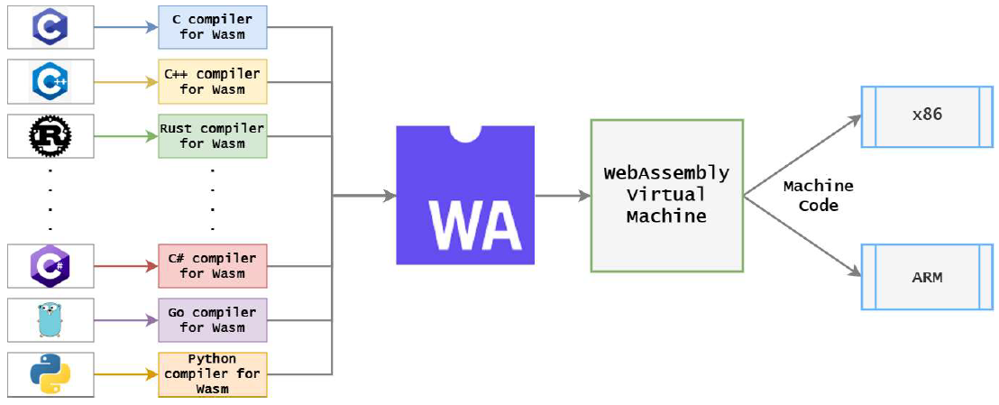
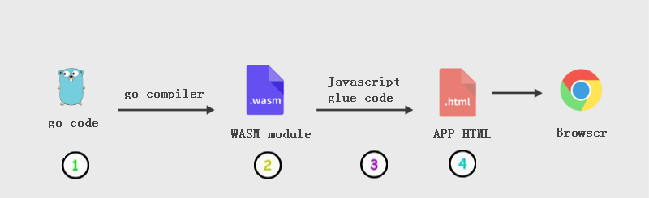
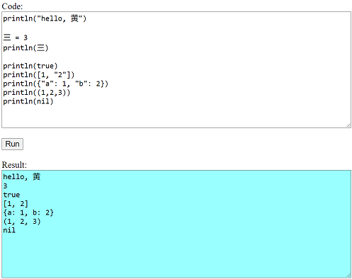

# `与浏览器交互`支持

在这一节中，我们要让脚本语言在浏览器中运行。这是如何实现的呢？实际上我们是通过`go`语言对`wasm`的支持来做到的。

所以在讲解之前，让我们简单了解一下什么是`wasm`?

## WebAssembly

### WebAssembly的简单定义

`WebAssembly`的缩写就是`wasm`。先看一下英文的简短解释：

```
WebAssembly is a new, low level binary code,for the web!
```

我们来逐个解释一下：

1. `new language`： WebAssembly被称为网络的第四种语言(前三种是HTML、CSS、 JavaScript)
2. `Binary`： 它不是人类可读的（它是一种用于网络的“汇编”语言）
3. `Low Level`：相对于JavaScript高级语言来说，它更接近于机器代码
4. `for the web`：意味着（现代）网络浏览器可以读取(read)和执行(execute)它们

### 我能使用WebAssembly做什么？

实际的WebAssembly是一种二进制语言。虽然有文本表示，但作为开发人员，我们通常不会在WebAssembly中“编写”代码！它实际上是一种IR（Intermediate Representation）或中间表示代码，类似于Java中的字节码或NET中的MSIL/CIL。通常我们都是使用高级语言（比如C/C++、Rust、go等）来写代码，然后通过它们的编译器将代码编译成WebAssembly模块。我们来看一副图（网上找的），来更好的理解一下：





### 为什么使用WebAssembly

既然WebAssembly是一种低级语言，而且对用户不易读，为什么我们还需要WebAssembly？

其中最主要的一点就是`性能（Performance）`。WebAssembly因为更接近机器语言，所以执行起来更快。


### 程序更改

编译代码之前，我们需要对程序做一个小小的改动。读者知道，我们程序输出信息使用的是`print`、`println`内置函数。但是它们默认是输出到标准输出。对于网页程序来说，它是输出到网页的`console`中去了。这个并不是我们希望的。因为对于网页中用户输入的脚本代码，我们希望运行结果输出到网页的某个控件上去（比如`textarea`框）。因此我们需要修改一下这几个内置函数的实现：

```go
//eval.go
func printBuiltin() *Builtin {
	return &Builtin{
		Fn: func(line string, scope *Scope, args ...Object) Object {
			resultStr := ""
			for _, arg := range args {
				resultStr = resultStr + arg.Inspect()
			}
			fmt.Fprint(scope.Writer, resultStr)
			return NIL
		},
	}
}

func printlnBuiltin() *Builtin {
	return &Builtin{
		Fn: func(line string, scope *Scope, args ...Object) Object {
			if len(args) == 0 {
				fmt.Fprintln(scope.Writer)
			}

			resultStr := ""
			for _, arg := range args {
				resultStr = resultStr + arg.Inspect() + "\n"
			}
			fmt.Fprint(scope.Writer, resultStr)
			return NIL
		},
	}
}
```

改动的地方在9、19、26行，之前我们是使用`fmt.Print`和`fmt.Println`函数，现在更改成了`fmt.Fprint`和`fmt.Fprintln`。

因为`Fprint`系列函数的第一个参数是一个`io.Writer`接口，就是说只要是实现了`io.Writer`这个接口的类型，都可以作为`FPrint`系列函数的第一个参数。来看看我们之前命令行运行解释器时候的代码：

```
l := lexer.NewLexer(input)
p := parser.NewParser(l)
program := p.ParseProgram()

scope := eval.NewScope(nil, os.Stdout)
eval.Eval(program, scope)
```

第5行我们给`NewScope`传递的第二个参数是`os.Stdout`（它实现了`io.Writer`接口），因此我们打印信息（以`println`为例）的时候，就相当于运行下面的代码：

```go
println("Hello World")
//===>
fmt.Fprint(os.Stdout, "Hello World")
```


当我们希望解释器在网页上运行的时候，我们的代码类似如下：

```
var buf bytes.Buffer

l := lexer.NewLexer(input)
p := parser.NewParser(l)
program := p.ParseProgram()

scope := eval.NewScope(nil, &buf)
eval.Eval(program, scope)
```

第7行的`NewScope`函数的第二个参数是一个`bytes.Buffer`类型（这个类型也实现了`io.Write`接口）。因此我们打印信息（以`println`为例）的时候，就相当于运行下面的代码：

```go
println("Hello World")
//===>
fmt.Fprint(buf, "Hello World") //输出到buf这个变量中，而不是输出到屏幕
```

这样一来，我们就可以使用之后编写的wasm客户端程序，将这个buf的内容输出到网页的某个控件上（比如`textarea`框）。


## 让解释器在浏览器中运行

先来看一下使用`go`语言编写WebAssembly时的通用目录构造：

```
Document(这个目录可以任意)
|
|____assets
|   |
|   |____index.html         # 主页
|   |____wasm_exec.js       # javascript glub代码，用来引入wasm模块并运行其中的代码
|   |____magpie.wasm       # `go`编译器生成的wasm模块
|
|____cmd
     |
     |____server
     |    |
     |    |____main.go     # 服务器代码
     |
     |____wasm
          |
          |____ main.go    # wasm模块代码
```

其中`assets`存放`index.html`文件和`wasm_exec.js`文件。`cmd`目录中的`server`目录存放服务器代码，`wasm`目录存放`客户端`代码。

> 对于`wasm_exec.js`文件，我们只需要从`go`安装路径根目录下的`misc/wasm`目录中，拷贝到我们的`assets`目录下即可：
>
> ```shell
> cp "$(go env GOROOT)/misc/wasm/wasm_exec.js" ~/Document/assets/
> ```


再来看一幅图，以便让读者更好的理解解释器是如何和浏览器交互的：



这幅图中的①就是我们的客户端代码（即`cmd/wasm/main.go`）。②是客户端代码经过`go`编译器编译成的wasm模块（即`assets`目录下的`magpie.wasm`文件）。③是`wasm_exec.js`文件，它的主要用处是加载wasm代码并在浏览器中运行它。④是`assets`目录下的`index.html`文件。

### wasm模块代码（客户端代码）

在`cmd/wasm`目录下，新建一个`main.go`代码：

```go
//这个this参数是javascript中的this关键字
//i参数是在JavaScript中调用该函数的参数列表
func runCode(this js.Value, i []js.Value) interface{} {
	m := make(map[string]interface{})
	var buf bytes.Buffer

	l := lexer.NewLexer(i[0].String()) //i[0].String()表示网页上的magpie脚本内容
	p := parser.NewParser(l)
	program := p.ParseProgram()
	if len(p.Errors()) != 0 { //如果有语法错误
		for _, msg := range p.Errors() {
			buf.WriteString(msg + "\n")
		}

		m["output"] = buf.String() //脚本的输出存放在key为"output"的map中
		return m
	}

	scope := eval.NewScope(nil, &buf)
	result := eval.Eval(program, scope)
	if (string(result.Type()) == eval.ERROR_OBJ) { //运行期错误
		m["output"] = buf.String() + result.Inspect() //脚本的输出 + 运行期错误信息
	} else {
		m["output"] = buf.String() //脚本输出
	}

	return m
}

func main() {
	c := make(chan struct{}, 0)
	js.Global().Set("magpie_run_code", js.FuncOf(runCode))
	<-c
}

```

第32行代码，我们的wasm模块导出了一个函数`magpie_run_code`，在之后要说的`index.html`文件中，我们可以使用JavaScript代码调用此方法。


`runCode`是一个普通的`go`函数，用来运行浏览器中用户输入的脚本。它返回一个map（即上面代码中的`m`变量），这个变量的`output`中包含程序的输出（如果有错误的话，还可能包含语法错误和运行期错误信息）。


第32行使用`js.Global().Set()` 方法，将函数 `runCode`注册到全局，以便在浏览器中能够调用。我们必须使用`js.FuncOf`函数将我们的go函数`runCode`转换成JavaScript能够调用的函数。

> go文档中关于`FuncOf`函数的说明：
>
> ​    `FuncOf` returns a function to be used by JavaScript.
>
> 它的原型：
>
> ```go
> func FuncOf(fn func(this Value, args []Value) interface{}) Func
> ```

31行我们创建了一个`channel`，然后第33行等待这个`channel`。有的读者可能会问，为啥要创建`channle`。这是因为`main()` 作为 `go`语言端的 main loop 在整个页面的生命周期中不能返回，因为后续在 JS 中对该模块中的 `go` 函数的调用，会在 main loop 的子协程中执行。说简单点：就是为了让wasm模块始终在运行状态。


接下来我们需要将这个客户端代码编译成`wasm`，命令如下：

```
GOOS=js GOARCH=wasm go build -o magpie.wasm main.go
```

这里我们将`GOOS`环境变量设置为`js`，同时将`GOARCH`环境变量设置为`wasm`，就是这么简单。之后将这个`magpie.wasm`移动到`assets`目录下即可。注意这个WebAssembly模块并不能够直接运行。如果直接运行，你看到的输出可能和下面的输出类似：

```
magpie.wasm: cannot execute binary file: Exec format error
```

原因是`magpie.wasm`是个`wasm` 二进制文件，它应该在浏览器沙箱（Browser Sandbox）中运行。

> Go 语言在 1.11 版本(2018年8月) 才开始加入了对 WebAssembly的支持。就是说你的go编译器的版本必须比1.11高。


### index.html文件

我们已经生成了`wasm`二进制模块，同时也有了JavaScript glue文件（wasm_exec.js）。下一步是创建一个`index.html`文件，并导入我们的`wasm`二进制模块。

> 【JavaScript glue】这个翻译成JavaScript胶水或者粘合剂，总感觉都不太好，还有没有更好的翻译？实在想不到更好的翻译了，所以暂时还是使用英文吧。

在`assets`目录下创建一个`index.html`文件，包含如下内容：

```html
<html>  
    <head>
        <title>Magpie playground</title>
        <meta charset="utf-8"/>
        <script src="wasm_exec.js"></script>

        <script>
            const go = new Go();
            WebAssembly.instantiateStreaming(fetch("magpie.wasm"), 
                    go.importObject).then((result) => {
                go.run(result.instance);
            });
        </script>

    </head>
    <body>
```

第8行我们创建了一个新的`go对象`（这个go对象是在`wasm_exec.js`文件中定义的）。

第9行，我们使用JavaScript的`WebAssembly`对象的`instantiateStreaming`方法来初始化`magpie.wasm`模块。这个函数返回一个`WebAssembly实例（WebAssembly instance）`。这个实例中包含一系列的`WebAssembly`函数（对于我们这里讲的`magpie.wasm`模块, 实际上只导出了一个`magpie_run_code`函数），这些函数可以被JavaScript调用。

第9行创建了`WebAssembly`实例后，我们在第11行用`go对象`的`run`方法来运行这个`wasm实例`。


> 【官方文档说明】：
>
> [`WebAssembly.instantiateStreaming()`](https://developer.mozilla.org/en-US/docs/Web/JavaScript/Reference/Global_Objects/WebAssembly/instantiateStreaming)
>
> Compiles and instantiates a WebAssembly module directly from a streamed underlying source, returning both a `Module` and its first `Instance`. This is the most efficient, optimized way to load wasm code.


现在我们需要在`index.html`的`body`tag中加入一个多行输入框`<textarea>`，并输入一些`magpie`脚本。同时我们需要一个按钮来运行这个输入框中的脚本。当然，还需要另外一个`<textarea>`来显示运行结果：

```html
<body>
    Code:<br>
    <textarea id="code" name="code" cols="80" rows="13">
        println("hello, 黄")
        
        三 = 3
        println(三)
        
        println(true)
        println([1, "2"])
        println({"a": 1, "b": 2})
        println((1,2,3))
        println(nil)
   
   </textarea>

   <br><br>

    <button type="button" onclick="run()">Run</button> <br><br>

    Result:<br>
    <textarea id="result" cols="80" rows="12" style="background-color:#99FFFF;" readonly></textarea>

    <script>
        function run() {
          let code = document.getElementById("code").value;
          let { output } = magpie_run_code(code)
          document.getElementById("result").value = output;
        }
    </script>

</body>
```

3-15行是`magpie`脚本输入框。我们预先输入了一些脚本。

> 为了代码看起来整齐，我对`magpie`脚本代码使用了缩进。

19行是一个运行按钮，用来运行脚本输入框中的代码。

22行是存放运行结果的只读输入框。

25-29行是按钮点击事件的代码。我们来分析一下：

```javascript
//得到脚本输入框中的代码
let code = document.getElementById("code").value;
//运行magpie脚本，这里的'magpie_run_code'就是我们的wasm模块导出的函数
//我们给它传递了一个参数，这个参数就是脚本输入框中的代码
let { output } = magpie_run_code(code)
```


这个`index.html`文件，在浏览器中的显示结果类似下面这样：



### Web服务器(Server)

现在我们有了JavaScript glue代码（`wasm_exec.js`），主页文件（`index.html`）和wasm二进制文件（`magpie.wasm`）。我们还需要创建一个Web服务器来服务assets文件夹的内容。

在`WebAssembly的目录构造`小节中的`cmd/server`目录下新建一个`main.go`主程序，内容如下：

```go
package main

import (
	"fmt"
	"net/http"
)

func main() {
	err := http.ListenAndServe(":9090", http.FileServer(http.Dir("../../assets")))
	if err != nil {
		fmt.Println("Failed to start server", err)
		return
	}
}
```

非常简单，仅仅启动一个`http`服务器（实际上是一个文件服务器），并在`9090`端口监听。服务目录是`assets`目录。

现在在命令行运行下面的命令：

```
go run main.go
```

然后打开浏览器，在网址中输入`http://localhost:9090`看一下运行效果吧。


下一节，我们将加入`for`循环的支持。

