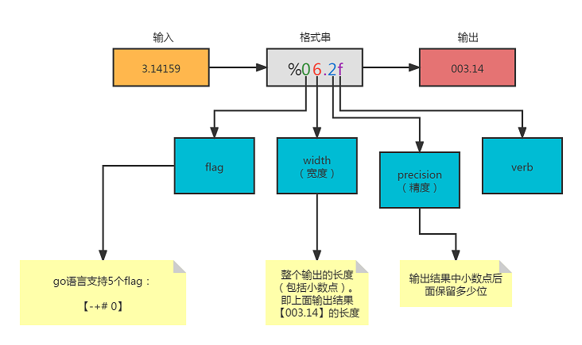
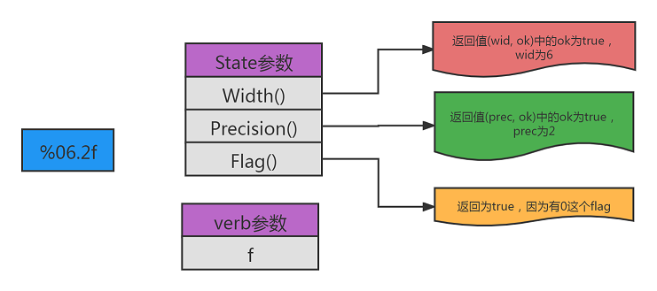
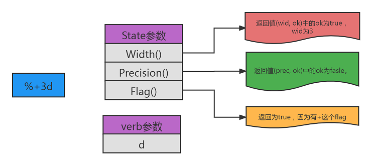
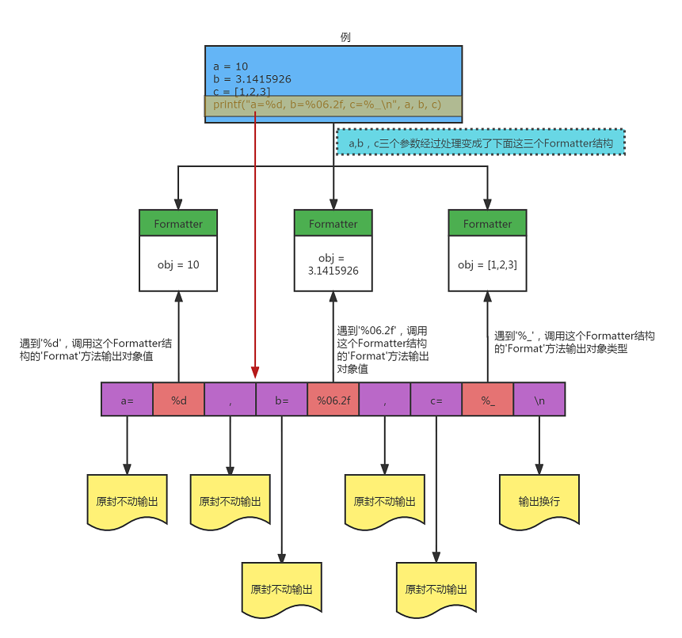

# `printf函数`支持

这一节，我们将提供一个更加丰富的`打印/输出`支持：`printf`内置函数。

在讲解之前，我们先来了解一下关于格式串的一些重要信息。

假设我们的语句如下：

```go
printf("%06.2f\n", 3.14159) // 输出: 003.14
//就是对于输入3.14159, 经过格式化"%06.2f"处理后，输出为"003.14"
```

我们来看一下图可能更直观一些：



请读者仔细理解这个图，这对之后的讲解非常关键。对于go语言所支持的5个flag`-+# 0`，我们举几个简单的例子，读者应该就明白了：

```go
fmt.Printf("12=[% 6d]\n", 12)     //flag为【空格】。结果：12=[    12]
fmt.Printf("12=[%06d]\n", 12)     //flag为【0】。  结果：12=[000012]
fmt.Printf("12=[%+6d]\n", 12)     //flag为【+】。  结果：12=[   +12]
fmt.Printf("18=[%#x]\n", 0x12)    //flag为【#】。  结果：18=[0x12]
fmt.Printf("18=[%#6x]\n", 0x12)   //flag为【#】。  结果：18=[  0x12]
```

接下来我们来了解一下`go`语言`fmt包`里定义的一个接口`Formatter`：

```go
type Formatter interface {
	Format(f State, verb rune)
}

//Fomat方法的第一个参数的类型
type State interface {
	//...
    
	Width() (wid int, ok bool)       //格式化中是否有宽度，如果有则返回值ok为true,wid为宽度的值
	Precision() (prec int, ok bool)  //格式化中是否有精度，如果有则返回值ok为true，prec为精度的值
	Flag(c int) bool                 //格式化中是否有flag，如果有则返回值为true
}
```

当我们的打印字符串中遇到格式化信息的时候（例如`%06.2f`，`%+6d`），go语言就会调用这个接口中的`Format`回调函数，并将所有的信息（`state`和`verb`）传递给这个函数。我们可以根据这两个参数，做一些额外的工作。

接下来我们来看一下`fmt.Printf()`的函数原型：

```go
func Printf(format string, a ...interface{}) (n int, err error)
```

它的第一个参数是一个格式化的字符串。当`fmt.Printf`遇到格式化信息的时候，就会调用这个`Formatter`接口中的`Format`方法进行相应的格式化输出。举个例子：

```go
a := 8
pi := math.Pi
fmt.Printf("pi=[%06.2f], a=[%+3d]\n", pi, a)
//结果：pi=[003.14], a=[ +8]
```

这个例子中，有两个格式化信息：一个是`%06.2f`，另一个是`%+3d`。因为有两个格式化信息，因此`Formatter`接口中的`Format`方法会被调用两次：

`%06.2f`是第一次调用，这时候go语言传递给`Format`方法的两个参数的内容如下图：




`%+3d`是第二次调用，这时候go语言传递给`Format`方法的两个参数的内容如下图：



有了上面的介绍，可以看出，`Formatter接口`中的`Format(state, verb)`方法的两个参数提供了所有我们需要的信息。

那么我们有了这些信息干什么呢？我们可以根据需要重新组装这个格式化信息，为我们程序所用。

还是让我们来看代码吧。我们新增了一个`Formatter`结构，这个结构中仅包含一个类型为`Object`的对象：

```go
//object.go
//这个Formatter结构主要用来实现上面说的`Formatter`接口。
type Formatter struct {
	Obj Object
}

const (
	availFlags = "-+# 0" //go支持的五个flag
)

//实现`Formatter`接口的‘Format’方法
func (ft *Formatter) Format(s fmt.State, verb rune) {
	//重新组装format
	format := make([]byte, 0, 128) //128足够大了。一般情况下，一个格式串'%xxx.xxxx'的长度应该远远小于128
	format = append(format, '%')

	//格式化中是否有flag，有的话则添加到format
	var f byte
	for i := 0; i < len(availFlags); i++ { //循环遍历5个flag
		f = availFlags[i]
		if s.Flag(int(f)) { //如果Flag()函数返回true,说明有flag
			format = append(format, f)
		}
	}

	var width, prec int
	var ok bool

	if width, ok = s.Width(); ok {//判断格式化中是否有宽度（width），有的话则ok为true
		format = strconv.AppendInt(format, int64(width), 10) //如果有宽度，将其加入format
	}
	
	if prec, ok = s.Precision(); ok {//判断格式化中是否有精度（precision），有的话则ok为true
		//如果有精度， 我们需要先在精度前加一个'.'，然后将精度值加入format
		format = append(format, '.')
		format = strconv.AppendInt(format, int64(prec), 10)
	}

    //如果verb的值大于`RuneSelf(=0x80)`,即大于一个字节。有这种情况吗？可能吧
	if verb > utf8.RuneSelf {
		format = append(format, string(verb)...)
	} else {
		if verb == '_' { // %_ -> %T。我们使用'%_'来打印Object（对象）的类型
			format = append(format, byte('T'))
		} else if verb == 'd' { //%d -> %g
			//如果格式中使用到%d的形式，由于我们的数字对象中
			//存储的是浮点类型，所以打印'12'会出现类似下面的内容：
			//  x=%!d(float64=12)
			//因此，这里我们把%d转换成%g
			format = append(format, byte('g'))
		} else { //除了"_"和"d"这两个外
			format = append(format, byte(verb)) //其它情况，原封不动添加到format
		}
	}

	formatStr := string(format) //这个就是转换后的格式化字符串
	/* fmt.Printf("formatStr=[%s]\n", formatStr) //调试用 */

	//上面我们将'%_'转换为go语言的'%T'后，打印对象类型会返回类似`*eval.Array`之类的字符串，
	//而我们希望打印的是`Array`。这里需要将'.'及其之前内容全部删除。
	if formatStr == "%T" {
		t := reflect.TypeOf(ft.Obj)
		strArr := strings.Split(t.String(), ".") //t.String() = "*eval.xxx"
		fmt.Fprintf(s, "%s", strArr[1])
		return
	}

    //根据转化后的格式化字符串，打印我们的对象系统中的对象
	switch obj := ft.Obj.(type) { //检查Formatter结构中存储的对象类型
	case *Boolean:
		fmt.Fprintf(s, formatStr, obj.Bool)
	case *Number:
		fmt.Fprintf(s, formatStr, obj.Value)
	case *String:
		fmt.Fprintf(s, formatStr, obj.String)
	default:
		fmt.Fprintf(s, formatStr, obj.Inspect())
	}
}

```

上面的实现需要关注的地方是42-49行的判断。假设我们遇到的格式化信息为`%_`，那么我们就会将其转换为`%T`，即打印对象类型。当遇到格式化信息为`%d`的时候，我们就会将其转换为`%g`，用来打印浮点数。

> 细心的读者可能会问了，为啥不直接使用`%T`呢？这个是我也觉得奇怪的地方。之前我们说过`Format(state, verb)`这个方法的`state`和`verb`两个参数中包含我们需要的所有格式化信息。但是唯独`%T`和`%p`这两个参数无法取到。
>
> 例如当遇到`%T`这个格式化信息的时候，按照刚才的分析，我们知道`verb`的值应该是`T`。经过我的测试，根本得不到这个`T`。这个我只在官方的文档中找到下面这句话（说实话，没有完全理解，哪位读者帮忙解读一下？）：
>
> > Except when printed using the verbs %T and %p, special formatting considerations apply for operands that implement certain interfaces.

还是让我们来举个例子吧：

```perl
a = 10
b = 3.1415926
c = [1,2,3]
printf("a=%d, b=%06.2f, c=%_\n", a, b, c)
```

对于第4行`printf`中的格式化信息有三个`%d`、`%06.2f`和`%_`。由于有三个格式化信息，所以会调用上面的`Format`方法三次：

* 第一次处理`%d`，得到的输出格式转换成了`%g`
* 第二次处理`%06.2f`，得到的输出格式不变，还是`%06.2f`
* 第三次处理`%_`，得到的输出格式转换成了`%T`

经过三次处理后，`printf`函数的第一个参数（即格式化参数）实际上变成了这样：`a=%g, b=%06.2f, c=%T\n`

有了上面的讲解，那么我们的`printf`内置函数也就差不多大功告成了，来看一下实现：

```go
//builtin.go
fn printf_function(line string, scope *Scope, args ...Object) Object {
	if len(args) < 1 {
		return newError(line, ERR_ARGUMENT, ">0", len(args))
	}

	formatObj, ok := args[0].(*String) //第一个参数是格式化字符串
	if !ok {
		return newError(line, ERR_PARAMTYPE, "first", "printf", "*String", args[0].Type())
	}

    //把其它参数包裹成一个Formatter结构
	subArgs := args[1:]
	wrapped := make([]interface{}, len(subArgs))
	for i, v := range subArgs {
		wrapped[i] = &Formatter{Obj: v}
	}

	formatStr := formatObj.String
    fmt.Fprintf(scope.Writer, formatStr, wrapped...) //将包裹的Formatter结构数组传递给`fmt.FPrintf()`

	return NIL
}

func printfBuiltin() *Builtin {
	return &Builtin{ Fn: printf_function }
}

func init() {
	builtins = map[string]*Builtin{
		//...
		"printf":  printfBuiltin(), //追加一个printf内置函数
	}
}

```

上面代码需要关注的就是13-20行，对于除了第一个参数（格式化字符串）的其它参数，我们将其包裹成了一个`Formatter`结构数组（13-17行）。然后将这个`Formatter`结构数组传递给`fmt.Fprintf()`函数。`fmt.Printf()`函数输出信息的时候，遇到格式化信息(例如`%05.2f`)时，就会调用`Formatter`结构的`Format`方法。具体看下图：




讲到这里，才知道`go`的实现者（膜拜）对这个`fmt.Printf()`函数的实现，设计的是多么的巧妙。佩服佩服！！！


最后，让我们写个简单的测试程序来测试一下`printf`：

```go
//main.go
func TestEval() {
	tests := []struct {
		input    string
		expected string
	}{
		{`a,b,c = 10, 3.1415926, [1,2,3] printf("a=%d, b=%06.2f, c=%_\n", a, b, c)`, "nil"},
		{`printf("Hello world\n")`, "nil"}, //测试第一个参数中没有格式化信息的情况
	}

	for _, tt := range tests {
		l := lexer.NewLexer(tt.input)
		p := parser.NewParser(l)
		program := p.ParseProgram()

		scope := eval.NewScope(nil, os.Stdout)
		evaluated := eval.Eval(program, scope)
		if evaluated != nil {
			if evaluated.Inspect() != tt.expected {
				fmt.Printf(%s\n", evaluated.Inspect())
			} else {
				fmt.Printf("%s = %s\n", tt.input, tt.expected)
			}
		}
	}
}

func main() {
	TestEval()
}
```

运行结果如下：

```
a=10, b=003.14, c=Array
Hello world
```


下一节，我们会增加`'&&和||'`的支持。
