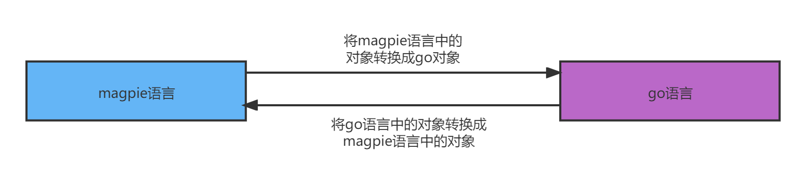

# 与`go`语言交互

我们的脚本语言是由`go`语言写的，那么怎么和`go`语言交互呢？下面先给出大致的思路，请看图：



实际上就是在`go`语言的`Value`系统和`magpie`的`对象（Object）`之间互相转换。

由于我们希望调用`go`语言package（包）中的任意函数，而这些package（包）中的函数接受的参数及其返回值也不尽一样，所以我们需要利用`go`语言的`reflect`机制，来实现我们的目的。

>  这里先声明一下，由于本节的内容比较复杂难懂（相对来说），如果读者理解起来比较困难的话，可以越过这节。而不会影响后续章节的阅读。


## `reflect(反射)`简介

所谓的反射，实际上就是在运行时动态的调用/修改对象的方法和属性。

`go`的`反射（reflect）`机制，主要是和`Value(值)`及`Type(类型)`打交道。在`go`的实现中，每个interface变量都有一个对应的pair，这个pair中记录了实际变量的`Value(值)`和`Type(类型)`。也就是说一个`interface{}`类型的变量包含两个指针：

* 一个指针指向实际的值，即对应的`Value`。
* 一个指针指向值的类型，即`Type`。

获取一个`interface{}`变量中的`Value(值)`和`Type(类型)`主要用到两个函数：

```go
func reflect.ValueOf(i interface{}) reflect.Value
func reflect.TypeOf(i interface{}) reflect.Type
```

第一行的`reflect.ValueOf`函数用于获取某个`interface{}`变量的值，若接口为空则返回0。

第二行的`reflect.TypeOf`函数用于获取某个`interface{}`变量的类型，若接口为空则返回nil。

下面我们举几个例子，让读者能够更好的理解一下上面说的内容：

```go
num := 3.1415926
fmt.Println(reflect.ValueOf(num)) // 3.1415926
fmt.Println(reflect.TypeOf(num))  // float64
```

第一行我们定义了一个浮点类型的变量`num`，第二行我们使用函数`reflect.ValueOf`打印它的值。第三行调用`reflect.TypeOf`打印变量`num`的类型。

下面是第二个例子：

```go
fn := fmt.Printf //将'fmt.Printf'赋值给一个变量

v := reflect.ValueOf(fn) //取得函数的值，即方法值(function value)
t := reflect.TypeOf(fn)  //取得函数的类型，即方法类型(function type)
fmt.Println(v) //0x49f180(这是个地址值，每个机器打印的结果可能会不同)
fmt.Println(t) //func(string, ...interface {}) (int, error)

if v.Kind() == reflect.Func { //判断值的类型是否是一个函数
	fmt.Printf("It is a function type\n") //这一行会被执行
}
```

第1行我们将一个`fmt.Printf`函数赋值给了`fn`变量。第3、4行分别取变量`fn`的值(Value)和类型(Type)。第5、6行打印值和类型。第8行判断值的种类(Kind)是否是一个函数。

再来看一下第三个例子：

```go
	strArr := []string{"Geeks", "for", "Geeks"}
	v := reflect.ValueOf(strArr)
	t := reflect.TypeOf(strArr)
	fmt.Println(v)  //[Geeks for Geeks]
	fmt.Println(t)  //[]string
        
	if v.Kind() == reflect.Slice {
		fmt.Printf("It is a Slice\n") //这一行会被执行
	}
```

那么我们如何动态调用方法并给其传递参数呢？这就需要用到另外一个方法：

```go
func (v Value) Call(in []Value) []Value
```

这里面的`v`必须是个函数类型，否则会报错。来看看动态调用的例子，这里假设我们希望以如下的方法调用`fmt.Printf`函数：

```go
fmt.Printf("Hello %s, I'm %s\n", "magpie", "hhf")
```

下面是使用`go`语言的`reflect`机制动态调用这个函数的实现：

```go
fn := fmt.Printf
fn_value := reflect.ValueOf(fn)

format := "Hello %s, I'm %s\n"
language := "magpie"
name := "hhf"

format_value := reflect.ValueOf(format)
language_value := reflect.ValueOf(language)
name_value := reflect.ValueOf(name)

args := []reflect.Value{}
args = append(args, format_value)
args = append(args, language_value)
args = append(args, name_value)

fn_value.Call(args); //打印： Hello magpie, I'm hhf
```

第1行我们将`fmt.Printf`赋值给了`fn`变量，现在你可以认为`fn`变量是指向`fmt.Printf`指针。第4、5、6行是给`fmt.Printf`函数传递的参数。因为`Call`函数接受的是`[]Value`，所以我们需要把这三个参数都转换为`Value`（8-10行），12-15行是将三个转换后的`Value`放入数组。第17行是真正的调用函数，会在终端输出`Hello magpie, I'm hhf`。

>  从上面的例子中可以看出，使用`reflect`机制动态调用函数，在速度上会比正常函数调用慢不少。

请仔细理解上面动态调用的例子。这样我们就能够进行下一步的讲解。


## 对象（Object）实现

首先我们要实现一个`Go对象`：

```go
//goobject.go
type GoObject struct {
	obj   interface{}     //go中的变量
    value reflect.Value   //上面obj参数，通过使用`reflect.ValueOf(obj)`取得的值
}

func (gobj *GoObject) Inspect() string  { return fmt.Sprint(gobj.obj) }
func (gobj *GoObject) Type() ObjectType { return GO_OBJ }
func (gobj *GoObject) CallMethod(line string, scope *Scope, method string, args ...Object) Object {
	//之后会讲实现
}

//工具函数(创建一个go对象)
func NewGoObject(obj interface{}) *GoObject {
	return &GoObject{obj: obj, value: reflect.ValueOf(obj)}
}

//object.go
const (
	GO_OBJ = "GO_OBJ"
)
```

我们的`GoObject`对象包含一个`interface{}`变量`obj`，用来表示`go`语言中的任意对象/变量。为了将来使用方便，我们还定义了一个`value`字段。上面的代码比较简单，唯一没有讲解的是`CallMethod`方法的实现。

在实现`CallMethod`方法之前，我们再来看一下`Call`方法的原型声明：

```go
func (v Value) Call(in []Value) []Value
```

假设我们的`magpie`脚本需要调用`go`语言的`fmt.Printf`函数，我们的magpie用户写的脚本代码如下：

```go
fmt.Printf("Hello, number %g\n", 1)
```

对于这个例子，我们传递的第一个参数是`magpie`对象系统中的`字符串(String)`对象(字面量是`"Hello, number %g\n"`)，第二个参数是一个`数字(Number)`对象(字面量是`1`)。

我们解释器的内部需要调用上面的`Call`方法来动态调用`fmt.Printf`函数，而`Call`方法接受的是`[]Value`，那么我们就需要像下面这样将`字符串(String)`对象和`数字(Number)`对象转换为`reflect.Value`。然后再调用这个`Call`方法：

```go
fn := fmt.Printf
fn_value := reflect.ValueOf(fn)

format := &String{String: "Hello, number %g\n"} //magpie的字符串对象
one := &Number{Value: 1}                        //magpie的数字对象

format_value := reflect.ValueOf(format.String) //装换为go语言的Value, 以便下面的Call方法调用
one_value := reflect.ValueOf(one.Value)        //装换为go语言的Value, 以便下面的Call方法调用

paramValues :=  []reflect.Value{}
paramValues = append(paramValues, format_value)
paramValues = append(paramValues, oen_value)

fn_value.Call(paramValues)
```

从上面的例子中可以看出，为了实现对`go`语言函数的动态调用，我们需要实现一个将magpie中的`Object`对象转换为`go`的`reflect.Value`的函数：

```go
//goobject.go
//转换magpie object到go value，
//  obj: magpie对象系统中的对象(Object)
//  typ: 函数参数实际需要的类型
func objectToGoValue(obj Object, typ reflect.Type) reflect.Value {
	var v reflect.Value
	switch obj := obj.(type) {
	case *Number:
		switch typ.Kind() { //判断函数实际需要的类型
		case reflect.Int:
			v = reflect.ValueOf(int(obj.Value))
		case reflect.Int8:
			v = reflect.ValueOf(int8(obj.Value))
		case reflect.Int16:
			v = reflect.ValueOf(int16(obj.Value))
		case reflect.Int32:
			v = reflect.ValueOf(int32(obj.Value))
		case reflect.Int64:
			v = reflect.ValueOf(int64(obj.Value))
		case reflect.Uint:
			v = reflect.ValueOf(uint(obj.Value))
		case reflect.Uint8:
			v = reflect.ValueOf(uint8(obj.Value))
		case reflect.Uint16:
			v = reflect.ValueOf(uint16(obj.Value))
		case reflect.Uint32:
			v = reflect.ValueOf(uint32(obj.Value))
		case reflect.Uint64:
			v = reflect.ValueOf(uint64(obj.Value))
		default:
			v = reflect.ValueOf(obj.Value)
		}
	case *String:
		v = reflect.ValueOf(obj.String)
	case *Boolean:
		v = reflect.ValueOf(obj.Bool)
	case *Nil:
		v = reflect.ValueOf(nil)
	case *GoObject:
		v = obj.value
	default:
		v = reflect.ValueOf(obj)
	}
	return v
}
```

上面的代码看起来还是比较简单的。对于字符串对象和布尔型对象，我们取出存储在里面的值，然后使用`reflect.ValueOf`函数得到相应的值（`reflect.Value`）。对于`GoObject`对象，我们取出对象中存储的值（`obj.value`）。而对于数字对象，我们需要将传入的数字对象（这里是`obj`）中保存的实际值（float64）强制转换为函数实际需要的类型。为啥要这个转换？举个例子：

```go
var i int = 52;
rand.Seed(i);
```

当编译这个go程序的时候，go编译器会报告如下错误：

```
cannot use i (type int) as type int64 in argument to rand.Seed
```

因为`rand.Seed()`函数的原型如下：

```go
func Seed(seed int64)
```

它接受的是`int64`类型，而我们传递了一个`int`类型的值，由于类型不兼容，导致了错误。


现在让我们来看一下`CallMethod`的实现：

```go
//goobject.go
func (gobj *GoObject) CallMethod(line string, scope *Scope, method string, args ...Object) Object {
	methodValue := gobj.value.MethodByName(method) //根据方法名取得其对应的Value
	if !methodValue.IsValid() {
		return newError(line, ERR_NOMETHOD, method, gobj.Type())
	}

	return callGoMethod(line, methodValue, args...)
}

func callGoMethod(line string, methodVal reflect.Value, args ...Object) (ret Object) {
	//错误处理
	defer func() {
		if r := recover(); r != nil {
			ret = newError(line, "error calling go method. %s", r)
		}
	}()

	methodType := methodVal.Type()
	//处理参数
	callArgs := []reflect.Value{}
	for i := 0; i < len(args); i++ {
		requestType := methodType.In(i) //函数参数实际需要的类型
		callArgs = append(callArgs, objectToGoValue(args[i], requestType))
	}

	retValues := methodVal.Call(callArgs) //动态调用go方法

	//处理返回值（将Call函数的返回值'[]Value'转换回magpie语言的'[]Object'）
	var results []Object
	for _, retVal := range retValues {
		switch retVal.Kind() {
		case reflect.Invalid: //nil
			results = append(results, NIL)
		case reflect.Bool:
			results = append(results, NewBooleanObj(retVal.Bool()))
		case reflect.String:
			results = append(results, NewString(retVal.String()))
		case reflect.Int, reflect.Int8, reflect.Int16, reflect.Int32, reflect.Int64:
			results = append(results, NewNumber(float64(retVal.Int())))
		case reflect.Uint, reflect.Uint8, reflect.Uint16, reflect.Uint32, reflect.Uint64:
			results = append(results, NewNumber(float64(retVal.Uint())))
		case reflect.Float64, reflect.Float32:
			results = append(results, NewNumber(retVal.Float()))
		default:
			results = append(results, NewGoObject(retVal.Interface()))
		}
	}

	//判断返回值个数
	if len(results) == 1 { //返回一个值
		ret = results[0]
	} else if len(results) > 1 { //返回多个值
		ret = &Tuple{Members: results, IsMulti: true}
	} else { //无返回值
		ret = NIL
	}

	return
}
```

第3-6行我们根据方法名称获取方法的`Value`，然后调用`IsValid()`函数判断是否存在此方法，如果不存在则返回错误对象(Error Object)。第8行调用`callGoMethod()`来真正的调用`go`语言包（package）中的方法。

`callGoMethod()`函数是个工具函数，我们将来还会用到这个函数。代码的21-25行将所有的参数`args`转换为go语言的`[]reflect.Value`。第27行的`Call()`方法用来动态调用go语言包（package）中的方法。第30-48行用来处理函数调用的返回值，因为`Call()`方法的返回值是个`[]Value`，所以我们需要将其转换为`magpie`语言的`[]Object`。代码51-57行是根据`Call()`函数的返回值的个数来返回相应的对象。第53-54行判断如果返回值大于1的话，我们会返回一个`Tuple`对象。如果没有返回值的话，我们默认返回`NIL`对象。

因为我们是使用的`Call()`方法来动态调用go语言包（package）方法的，因此很可能会导致调用失败（例如传入的参数个数不对，或者参数类型不对等），所以代码的13-17行用来捕获这种错误。如果调用失败，则我们会捕获这种错误，并返回一个错误对象(Error Object)。

> 注：`callGoMethod()`方法存在不少的缺陷。例如，没有判断实参和形参个数是否一致，传入的参数的类型是否一致，参数是否合法等等。为了简单起见，这里统统没有处理。


前面介绍的`objectToGoValue()`函数，实现了将`magpie`对象（Object）转换为`go`语言的`reflect.Value`的方法。我们还需要提供一个相反的方法`goValueToObject()`：

```go
//goobject.go
//将go语言的`Value`转换为magpie脚本的'Object'
func goValueToObject(v interface{}) Object { //参数'v'是go语言的对象
	val := reflect.ValueOf(v)
	kind := val.Kind()

	switch kind { //判断Value的类型
	case reflect.Slice, reflect.Array: //数组或切片，则将其转换为magpie语言的Array数组对象
		ret := &Array{}
		for i := 0; i < val.Len(); i++ {
			ret.Members = append(ret.Members, goValueToObject(val.Index(i).Interface()))
		}
		return ret

	case reflect.String: //字符串
		return NewString(val.String())

	//整形或者浮点型
	case reflect.Int, reflect.Int8, reflect.Int16, reflect.Int32, reflect.Int64:
		return NewNumber(float64(val.Int()))
	case reflect.Uint, reflect.Uint8, reflect.Uint16, reflect.Uint32, reflect.Uint64:
		return NewNumber(float64(val.Uint()))
	case reflect.Float32, reflect.Float64:
		return NewNumber(val.Float())

	case reflect.Bool: //布尔型
		if v.(bool) {
			return TRUE
		} else {
			return FALSE
		}
	case reflect.Invalid: //nil
		return NIL
	default:
		return NewGoObject(v) //其它情况，则返回'GoObject'对象
	}
}
```

代码还是比较好理解的。4-5行取得参数`v`的种类（Kind），然后判断其类型。8-13行判断如果是数组或者切片的话，则返回一个数组（Array）对象。15-16行判断如果为字符串，则返回字符串对象。19-24行判断如果是整形或者浮点型，则返回数字对象。26-31行判断布尔型，如果为`true`的话，返回`TRUE`布尔对象。如果为`false`的话，返回`FALSE`布尔对象。32行判断如果为`Invalid（即nil）`的话，则返回`NIL`对象。其它情况，我们返回本节开始介绍的`GoObject`对象。

下面我们来看一下用户怎么注册`go`变量和函数呢？我们提供了两个方法`RegisterGoVars()`和`RegisterGoFunctions()`，分别用来注册`go`语言的变量和函数。来看一下调用例子：

```go
//注册go变量
RegisterGoVars("runtime", map[string]interface{}{
	"GOOS":   runtime.GOOS,
	"GOARCH": runtime.GOARCH,
})

//注册go函数
RegisterGoFunctions("fmt", map[string]interface{}{
	"Println":  fmt.Println,
	"Printf":   fmt.Printf,
})
```

注册了上面的变量和函数后，我们就可以在`magpie`脚本中像下面这样调用注册的函数和变量了：

```javascript
fmt.Printf("Hello %s!\n", "go function")
fmt.Println(runtime.GOOS)
```

从这个例子中可以看到，实际上这就是类似`obj.var`和`obj.method(xxx, xxx, ...)`的方法调用。那么当解释器遇到了`fmt`和`runtime`这样的标识符的时候，怎么判定就是我们注册的对象呢？我们先以之前学过的数组的例子来看一下：

```javascript
let arr = [1, 10.5, "Hello", true]
arr.push("world")
```

当解释器碰到第一行的`let`语句的时候，它就是调用`evalLetStatement()`方法，将`arr`标识符放入Scope中保存起来，类似下面这样：

```go
scope.Set("arr", arrayObject)
```

当解释器遇到第二行的`arr.push`的时候，它调用的代码类似如下：

```go
obj := Eval(call.Object, scope) //这里的call.Object就是'arr'
obj.CallMethod(xxx, scope, method.Function.String(), args...) //这里method.Function.String()就是'push'
```

第一行调用`Eval()`方法得到`obj`这个数组对象(实际上会调用`evalIdentifier()`方法从Scope中取)，然后第二行调用这个数组对象的`CallMethod()`方法。

那么对于上面的`fmt.Printf`或者`fmt.Println`中的`fmt`标识符，解释器到哪里去找呢？又怎么知道这个`fmt`代表的是个什么对象呢？因为这个`fmt`标识符是没有定义的，所以从Scope中是找不到的。那么怎么解决这个问题呢？实际上我们可以使用另外一个Scope，这里称为全局Scope（`Global Scope`），将这个`fmt`标识符预先放入这个全局Scope中，然后在`evalIdentifier()`方法中在增加一个从全局Scope中取标识符的判断就可以了。来看一下代码：

```go
//scope.go
var GlobalScopes map[string]Object = make(map[string]Object)

func GetGlobalObj(name string) (Object, bool) {
	obj, ok := GlobalScopes[name]
	return obj, ok
}

func SetGlobalObj(name string, Obj Object) {
	GlobalScopes[name] = Obj
}
```

第2行我们定义了一个名为`GlobalScopes`的map变量，然后我们定义了两个方法`GetGlobalObj()`和`SetGlobalObj()`两个方法。`GetGlobalObj()`用来从`GlobalScopes`这个map中取得保存的对象。`SetGlobalObj()`用来将对象保存到`GlobalScopes`这个map中。

有了这两个方法后，我们就可以实现`RegisterGoVars()`和`RegisterGoFunctions()`方法了。先来看一下`RegisterGoVars`的实现：

```go
//goobject.go

var (
	ERR_HASDOT = errors.New("symbol contains '.'")
)

//注册go变量
/*
RegisterGoVars("runtime", map[string]interface{}{
	"GOOS":   runtime.GOOS,
	"GOARCH": runtime.GOARCH,
	...
})
使用例：println(runtime.GOOS)
*/
func RegisterGoVars(name string, vars map[string]interface{}) error {
	for k, v := range vars {
		if strings.Contains(k, ".") {
			return ERR_HASDOT
		}
		SetGlobalObj(name + "." + k, NewGoObject(v))
	}

	return nil
}
```

第17行循环遍历注册的变量。第18-20行判断变量中是否含有`句号（.）`。如果有的话，就报错返回。第21行将注册的变量放入全局Scope中。为啥不能包含`.`呢？这个其实很好理解，假设我们像下面这样使用`RegisterGoVars()`方法：

```go
RegisterGoVars("runtime", map[string]interface{}{
	"GO.OS":   runtime.GOOS,
})
```

那么上面实现代码的第21行就变成了`runtime.GO.OS`。这样就变成了`obj1.obj2.variable`形式的方法调用了。这样处理起来就比较麻烦了。

下面让我们来看一下`RegisterGoFunctions()`方法的实现：

```go
//goobject.go

var (
	ERR_VALUENOTFUNCTION = errors.New("symbol value not function")
)

//注册go函数
/*
RegisterGoFunctions("fmt", map[string]interface{}{
	"Println":  fmt.Println,
	"Printf":   fmt.Printf,
})
使用例：fmt.Println("Hello world!")
*/
func RegisterGoFunctions(name string, vars map[string]interface{}) error {
	hash := NewHash()
	for k, v := range vars {
		val := reflect.ValueOf(v)
		if val.Kind() != reflect.Func { //如果v不是函数，报错返回
            return ERR_VALUENOTFUNCTION
		}

		if strings.Contains(k, ".") { //包含'.'报错返回
			return ERR_HASDOT
		}

		key := NewString(k)
		hash.push("", key, NewGoFuncObject(k, v))
	}

	newName := strings.Replace(name, "/", "_", -1)
	SetGlobalObj(newName, hash)

	return nil
}
```

第13-16行判断map的key-value中的value是否为一个函数，如果不是函数则报错。23-25行，如果函数名存在`.`则报错返回。第28行将`go函数对象(Go Function Object)`放入哈希对象（在第16行生成）。这里的`go函数对象`将会在下面讲到。第31行判断`name`变量中是否含有`/`，如果有则将其更换为`_`（-1表示全部替换）。第32行将哈希对象放入新生成的名字中。31行为什么要做这个替换呢？让我们看一个例子：

```javascript
	RegisterFunctions("math/rand", map[string]interface{}{
		"Seed": rand.Seed,
		"Intn": rand.Intn,
	})
```

如果我们不将`math/rand`中的`/`替换为`_`的话，那么使用的时候就会变成下面这样：

```go
math/rand.Seed(xxx)
```

解释器就会误认为成下面这样：

```go
( math ) / ( rand.Seed(xxx) )
```

即`math`变量除以`rand.Seed(xxx)`，显然不是我们期望的。

将`/`替换为`_`后，我们就可以像下面这样使用了：

```go
math_rand.Seed(xxx)
```


上面提到`go函数对象(Go function object)`我们还没有讲。现在来看一下它的实现：

```go
//goobject.go
//go函数的包装器对象（wrapper for go functions)
type GoFuncObject struct {
	name string
	typ  reflect.Type
	fn   interface{}
}

func (gfn *GoFuncObject) Inspect() string  { return gfn.name }
func (gfn *GoFuncObject) Type() ObjectType { return GFO_OBJ }

func (gfn *GoFuncObject) CallMethod(line string, scope *Scope, method string, args ...Object) Object {
	return callGoMethod(line, reflect.ValueOf(gfn.fn), args...)
}

func NewGoFuncObject(fname string, fn interface{}) *GoFuncObject {
	return &GoFuncObject{fname, reflect.TypeOf(fn), fn}
}

//object.go
const (
	GFO_OBJ = "GFO_OBJ"
)
```

第3-6行定义了一个`GoFuncObject`结构，其中变量`name`是函数名，变量`fn`是函数指针，变量`typ`是变量`fn`的类型（通过`reflect.TypeOf(fn)`得到）。第16行是个工具函数（utility function），用来生成一个`go函数对象(go function object)`。


接下来，我们的`goObject`可能还能够作为`for xxx in Obj`中的`obj`，如果`goObj`中的`obj`变量是一个数组或者分片(slice)的话。因此我们还需要实现`iterable`接口的`iter()`方法：

```go
//goobject.go
func (gobj *GoObject) iter() bool {
	kind := gobj.value.Kind()

	switch kind {
	case reflect.Slice, reflect.Array:
		return true
	default:
		return false
	}
}
```


## 解释器更改

前文也提到了，我们注册的`go对象(Go Object)`和`go函数对象(Go Function Object)`都保存在了一个全局Scope中。因此我们需要更改`evalIdentifier`，使其从全局Scope中查找对象：

```go
//eval.go
func evalIdentifier(node *ast.Identifier, scope *Scope) Object {
	//从全局Scope中获取对象
	if obj, ok := GetGlobalObj(node.Value); ok {
		return obj
	}

    //从Scope中获取对象
	if val, ok := scope.Get(node.Value); ok {
		return val
	}

	//...
}
```

3-6行是新增的代码，没啥可解释的。

另外我们的go对象还可能会用在`for item in goObj`循环中，如果`goObj`是个数组或者数组切片（Slice）:

```go
//eval.go
func evalForEachArrayExpression(fal *ast.ForEachArrayLoop, scope *Scope) Object { //fal:For Array Loop
	//...

	var members []Object
	if aValue.Type() == STRING_OBJ {
		//...
	} else if aValue.Type() == ARRAY_OBJ {
		//...
	} else if aValue.Type() == TUPLE_OBJ {
		//...
	} else if aValue.Type() == GO_OBJ { //'for item in goObj'
		goObj := aValue.(*GoObject)
		arr := goValueToObject(goObj.obj).(*Array)
		members = arr.Members
	}

	//...
}
```

12-16行是新增的逻辑。如果是`go对象`的话，我们将go对象转换为magpie中的数组对象(14行)。

我们还需要更改`objectToNativeBoolean`方法，将`go对象(GoObject)`对象转换为布尔型：

```go
func objectToNativeBoolean(o Object) bool {
	if r, ok := o.(*ReturnValue); ok {
		o = r.Value
	}
	switch obj := o.(type) {
	case *Boolean:
		return obj.Bool
	case *Nil:
		return false
	//...
	case *GoObject:
		goObj := obj
		tmpObj := goValueToObject(goObj.obj)
		return objectToNativeBoolean(tmpObj)
	default:
		return true
	}
}
```

第11-14行是新增的逻辑。如果是`go对象(GoObject)`，我们将其存储的go变量转换为magpie系统的对象，然后调用`objectToNativeBoolean`函数自身。

另外，我们有判断真假的函数`IsTrue`，这个也需要做相应的更改：

```go
func IsTrue(obj Object) bool {
	switch obj {
	case TRUE:
		return true
	case FALSE:
		return false
	case NIL:
		return false
	default:
		switch obj.Type() {
		case NUMBER_OBJ:
			if obj.(*Number).Value == 0.0 {
				return false
			}
		case ARRAY_OBJ:
			if len(obj.(*Array).Members) == 0 {
				return false
			}
		//...
		case GO_OBJ:
			goObj := obj.(*GoObject)
			return goObj.obj != nil
		}
		return true
	}
}
```

20-22行的`case`分支是新增的逻辑。

magpie脚本用户可能写了如下的代码：

```javascript
let x = goObj1.Method1(xxx, xxxx) + goObj2.Method2(xxx, xxxx)
```

这个例子中，对于等式右边的`goObj1.Method1(xxx, xxxx) + goObj2.Method2(xxx, xxxx)`，这里是个`中缀表达式(InfixExpression)`，如果两个方法返回的都是go对象的话，我们需要将其转换成magpie中的Object：

```go
func evalInfixExpression(node *ast.InfixExpression, left, right Object, scope *Scope) Object {
	if left.Type() == GO_OBJ {
		left = goValueToObject(left.(*GoObject).obj)
	}
	if right.Type() == GO_OBJ {
		right = goValueToObject(right.(*GoObject).obj)
	}

	//...
}
```

2-7行是新增的逻辑。如果是`go对象(GoObject)`的话，我们就取出其中存储的对象(`obj`)，然后将其转换为magpie中的Object。


最后，我们还需要修改`evalMethodCallExpression`函数：

```go
func evalMethodCallExpression(call *ast.MethodCallExpression, scope *Scope) Object {
	str := call.Object.String()
	if obj, ok := GetGlobalObj(str); ok { //从全局Scope中查找
		switch o := call.Call.(type) {
		case *ast.Identifier: //变量调用，例如: os.xxx
			if i, ok := GetGlobalObj(str + "." + o.String()); ok {
				return i
			}
		case *ast.CallExpression: //函数调用， 例如: 'fmt.Printf()'
			if method, ok := call.Call.(*ast.CallExpression); ok {
				args := evalExpressions(method.Arguments, scope)
				if len(args) == 1 && isError(args[0]) {
					return args[0]
				}

				if obj.Type() == HASH_OBJ { // GoFuncObject
					foundMethod := false
					hash := obj.(*Hash)
					for _, pair := range hash.Pairs {
						funcName := pair.Key.(*String).String
						if funcName == o.Function.String() {
							foundMethod = true
							goFuncObj := pair.Value.(*GoFuncObject)
							return goFuncObj.CallMethod(call.Call.Pos().Sline(), 
									scope, o.Function.String(), args...)
						}
					}
					if !foundMethod {
						return newError(call.Call.Pos().Sline(), ERR_NOMETHODEX, str, 
							o.Function.String(), str, strings.Title(o.Function.String()))
					}
				} else {
					return obj.CallMethod(call.Call.Pos().Sline(), scope, 
										o.Function.String(), args...)
				}
			}
		}
	} else {
		if obj, ok := GetGlobalObj(str + "." + call.Call.String()); ok {
			return obj
		}
	}

	//...
}
```

第3行，我们判断对象是否存在于全局Scope中，如果存在，则继续判断`obj.call`中的`call`是否是个变量或者函数调用，如果是变量调用则从全局变量中取出保存的值后返回（5-8行）。如果是个函数调用，再继续判断是否是个`go函数对象(go function object)`，如果是，则调用`go函数对象`的`CallMethod()`方法（24行）。否则调用内置对象的`CallMethod()`方法（33行）。

如果对象`obj`不存在于全局Scope中，则调用39-40行的代码。这段逻辑主要是处理使用`RegisterGoVars`方法注册的go变量。


## 测试


```go
func TestEval() {
	tests := []struct {
		input    string
		expected string
	}{
		{`fmt.Printf("Hello %s!\n", "go function"); println()`, "nil"},
		{`s = fmt.Sprintf("Hello %s!", "World"); println(s)`, "nil"},
		{`fmt.Println(runtime.GOOS); println()`, "nil"},
		{`fmt.Println(runtime.GOARCH); println()`, "nil"},
	}

	for _, tt := range tests {
		l := lexer.NewLexer(tt.input)
		p := parser.NewParser(l)
		program := p.ParseProgram()
		if len(p.Errors()) != 0 {
			for _, err := range p.Errors() {
				fmt.Println(err)
			}
			break
		}

		scope := eval.NewScope(nil, os.Stdout)
		evaluated := eval.Eval(program, scope)
		if evaluated != nil {
			if evaluated.Inspect() != tt.expected {
				fmt.Printf("%s", evaluated.Inspect())
			} else {
				fmt.Printf("%s = %s\n", tt.input, tt.expected)
			}
		}
	}
}

// Register go package methods/types
func RegisterGoGlobals() (err error) {
	err = eval.RegisterGoFunctions("fmt", map[string]interface{}{
		"Printf":   fmt.Printf,
		"Println":  fmt.Println,
		"Sprintf":  fmt.Sprintf,
	})
	if err != nil {
		return
	}

	err = eval.RegisterGoVars("runtime", map[string]interface{}{
		"GOOS":   runtime.GOOS,
		"GOARCH": runtime.GOARCH,
	})

	return
}

func main() {
	err := RegisterGoGlobals()
	if err != nil {
		fmt.Printf("RegisterGoGlobals failed: %s\n", err)
		os.Exit(1)
	}

	TestEval()
}
```


下一节，我们将介绍如何捕获程序中出现的致命错误。
