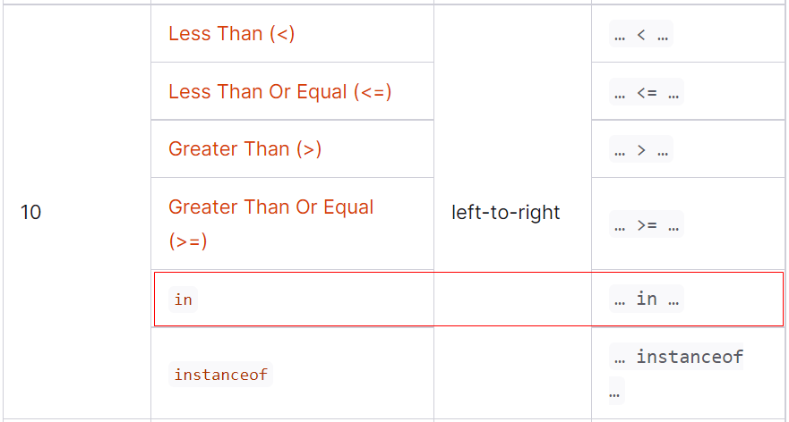

# `in操作符`支持

这一节中，我们将给`magpie语言`增加`in操作符`（in operator）的支持。先来看一下使用例：

```perl
# 数组
if 1 in [1, "2"] {
  println("1 in array")
}

# 元祖
if "2" in (1, "2") {
  println("2 in tuple")
}

# 哈希
if "name" in {"name": "hhf", "height": 165} {
    println("name in hash")
}

# 字符串
if "hello" in "hello world" {
    println("hello in 'hello world'")
}
```

有的人可能会问，为什么`in`这个关键字是一个操作符？那么从上面的例子中我们可以知道，`in`的形式如下：

```c#
<expression> in <expression>
```

我们来对比一下`+`操作符的形式：

```c#
<expression> + <expression>
```

是不是非常相似？ 这里强调一下，语言的操作符（operator）并不一定必须是符号(例如: +、-、*、/等)，也可以是标识符（例如这里的`in`）。

现在让我们看一下需要做哪些更改? 如果读者还有印象的话，我们在介绍`for`语句（`for item in xxx`）的时候，已经使用过了`in`关键字，因此我们的词法分析器（Lexer）不需要更改。这一节，我们将`in`这个关键字作为中缀操作符来使用，因此我们需要给这个操作符赋优先级，同时需要给`in`操作符注册中缀回调函数。另外，我们还需要更改解释器（Evaluator）来解释`in`操作符。


## 语法解析器（Parser）的更改

对于`in`操作符，我们需要给它注册中缀表达式回调函数：

```go
//parser.go
func (p *Parser) registerAction() {
	//...
	p.registerInfix(token.TOKEN_IN, p.parseInfixExpression)
}
```

非常简单，是吧。现在让我们来看一下`in`操作符的优先级。我们给它赋个什么优先级比较合适呢？是不是不太容易得出结论？如果实在不好想的话，这里给大家一个非常简单的结论：`参照主流语言`。比如`javascript`里也有这个`in`操作符，那么我们参照`javascript`语言对于`in`操作符的优先级的设置即可。下面是`javascript`官方网站关于操作符优先级的一个截图：



可以看到`in`操作符的优先级和比较操作符的优先级是一样的（都是10）。确定了优先级，那么问题就变得相对简单了：

```go
//parser.go
var precedences = map[token.TokenType]int{
	//...

	token.TOKEN_LT: LESSGREATER,
	token.TOKEN_LE: LESSGREATER,
	token.TOKEN_GT: LESSGREATER,
	token.TOKEN_GE: LESSGREATER,
	token.TOKEN_IN: LESSGREATER,
}
```

第9行是新增的代码。


## 解释器（Evaluator）的更改

由于`in`操作符是一个中缀操作符，因此我们需要更改`evalInfixExpression`这个函数：

```go
//eval.go
func evalInfixExpression(node *ast.InfixExpression, left, right Object, scope *Scope) Object {
	//...

	operator := node.Operator
	switch {
	case operator == "in":
		return evalInExpression(node, left, right, scope)
	//...
	}
}
```

7-8行是新增的代码，如果中缀操作符是`in`，那么我们就调用`evalInExpression`函数。来看一下`evalInExpression`函数的实现：

```go
//eval.go
//<left> in <right>
func evalInExpression(node *ast.InfixExpression, left, right Object, scope *Scope) Object {
	switch r := right.(type) {
	case *String: //如果为字符串类型，则调用`strings.Index`方法
		substr := left.(*String).String
		idx := strings.Index(r.String, substr)
		if idx == -1 {
			return FALSE
		}
		return TRUE
	case *Array: //如果是数组
		for _, v := range r.Members {
			r := reflect.DeepEqual(left, v) //使用reflect.DeepEqual来比较
			if r {
				return TRUE
			}
		}
		return FALSE
	case *Tuple: //元祖
		for _, v := range r.Members {
			r := reflect.DeepEqual(left, v)
			if r {
				return TRUE
			}
		}
		return FALSE
	case *Hash: //哈希
		hashable, ok := left.(Hashable) //判断是否可哈希化
		if !ok {
			return newError(node.Pos().Sline(), ERR_KEY, left.Type())
		}

		if _, ok = r.Pairs[hashable.HashKey()]; ok {
			return TRUE
		}
		return FALSE
	default:
		return newError(node.Pos().Sline(), ERR_INFIXOP, left.Type(), "in", right.Type())
	}

	return FALSE
}
```

代码虽然有些多，但是理解起来应该不难。


## 测试

```javascript
# 数组
if 1 in [1, "2"] {
  println("1 in array")
}

# 元祖
if "2" in (1, "2") {
  println("2 in tuple")
}

# 哈希
if "name" in {"name": "hhf", "height": 165} {
    println("name in hash")
}

# 字符串
if "hello" in "hello world" {
    println("hello in 'hello world'")
}

```


下一节，我们将加入范围操作符(`..`)支持（例如`1..10`）。


