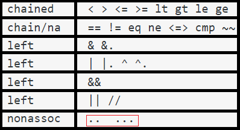

# `范围操作符(..)`支持

这一节中，我们将给`magpie语言`增加`范围操作符`（range operator）的支持。先来看一下使用例：

```perl
nums = 1..10
for item in nums { # 或者直接写成这样：for item in 1..10 {}
    println(item)
}
```

对于`..`操作符，我们可以看到其一般形式如下：

```c#
<expression> .. <expression>
```

可以看到`..`是个中缀操作符。如果这样理解的话，下面关于代码的修改就会很容易理解了。

下面看一下我们需要做哪些更改：

1. 在词元（Token）源码`token.go`中加入新的词元（Token）类型(`..`)
2. 在词法分析器（Lexer）源码`lexer.go`中加入对`..`的识别
3. 在语法解析器（Parser）的源码`parser.go`中加入对`..`的语法解析及其优先级的设定。
4. 在解释器（Evaluator）的源码`eval.go`中加入对`..`的解释。


## 词元（Token）的更改

```go
//token.go
const (
	//...

	TOKEN_DOTDOT     //..

	//...
)

//词元类型的字符串表示
func (tt TokenType) String() string {
	switch tt {
	//...

	case TOKEN_DOTDOT:
		return ".."

	//...
}
```
第5行和15-16行是新增的代码。


## 词法分析器（Lexer）的更改

```go
//lexer.go
func (l *Lexer) NextToken() token.Token {
	//...

	switch l.ch {
	//...

	case '.':
		if l.peek() == '.' {
			tok = token.Token{Type: token.TOKEN_DOTDOT, 
                              Literal: string(l.ch) + string(l.peek())}
			l.readNext()
		} else {
			tok = newToken(token.TOKEN_DOT, l.ch)
		}

	//...
	}

	//...
}
```

8-15行是修改及新增的代码。


## 语法解析器（Parser）的更改

对于`..`操作符，我们需要给它注册中缀表达式回调函数：

```go
//parser.go
func (p *Parser) registerAction() {
	//...
	p.registerInfix(token.DOTDOT, p.parseInfixExpression)
}
```

非常简单，是吧。`parseInfixExpression`函数是既存的函数，无需更改。

现在让我们来看一下`..`操作符的优先级。类似上一节我们给`in`操作符赋优先级一样，我们将`参照主流语言`。这里我参照的是`perl`语言。来看一下`perl`语言中`..`操作符的优先级：



可以看到`..`操作符的优先级比`||`的优先级还要低。因此我们只需要将`..`操作符的优先级设置为比`||`操作符的优先级低即可。来看一下代码：

```go
//parser.go
const (
	//...
	LOWEST

	RANGE        // ..
	CONDOR       // ||
	CONDAND      // &&

	//...
)

var precedences = map[token.TokenType]int{
	//...

	token.TOKEN_DOTDOT:   RANGE,
}
```

## 解释器（Evaluator）的更改

毫无疑问，我们需要修改`evalInfixExpression`这个函数：

```go
//eval.go
func evalInfixExpression(node *ast.InfixExpression, left, right Object, scope *Scope) Object {
	//...

	operator := node.Operator
	switch {
	case operator == "..":
		return evalRangeExpression(node, left, right, scope)
	//...
	}
}
```

7-8行是新增的代码，如果中缀操作符是`..`，那么我们就调用`evalRangeExpression`函数。来看一下`evalRangeExpression`函数的实现：

```go
//eval.go
//<left> .. <right>
func evalRangeExpression(node *ast.InfixExpression, 
                         left, right Object, scope *Scope) Object {
	arr := &Array{}
	switch l := left.(type) {
	case *Number:
		startVal := int64(l.Value) //取开始值

		var endVal int64
		switch r := right.(type) {
		case *Number:
			endVal = int64(r.Value) //取结束值
		default:
			return newError(node.Pos().Sline(), ERR_RANGETYPE, NUMBER_OBJ, right.Type())
		}

		var j int64
		if startVal >= endVal { // 10..1
			for j = startVal; j >= endVal; j = j - 1 {
				arr.Members = append(arr.Members, NewNumber(float64(j)))
			}
		} else { //1..10
			for j = startVal; j <= endVal; j = j + 1 {
				arr.Members = append(arr.Members, NewNumber(float64(j)))
			}
		}
	default:
		return newError(node.Pos().Sline(), ERR_RANGETYPE, NUMBER_OBJ, left.Type())
	}

	return arr
}
```

代码虽然有些多，但是理解起来应该不难。对于`a..b`这种范围操作符，我们实际上是将其看作为一个数组。例如：

```perl
1..3
#等价于
[1,2,3]
```

## 测试

```perl
nums = 1..10
for item in nums { # 或者直接写成这样：for item in 1..10 {}
    println(item)
}

for item in 10..5 {
    println(item)
}

# 来个复杂点的
for item in fn(a,b){ a + b }(1,1) .. fn(a,b){ a - b }(10,5) { # 即 'for item in 2..5'
    println(item)
}
```


终于完成了，可以喘口气了。这是最后的一篇文章。相信通过这一系列的学习，读者已经了解了自制语言的基本步骤，甚至可以自行编写自制语言了。希望本系列文章能够给读者带去哪怕一丝丝的自豪感，我也倍感荣幸！！!

其实有很多的话要说，也不知道该说些啥，就到这吧。


